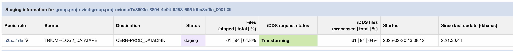

============================
Data Carousel for analysis
============================

The Data Carousel is a system designed to optimize tape usage. Tapes require special handling to minimize wear and ensure equitable access.

Tasks relying exclusively on tape replicas for part of their input data are automatically configured to utilize the Data Carousel. Upon creation, these tasks initially have a status of ``staging`` as staging rules for their inputs are established. The time required to create these rules depends on factors such as current tape load, task share, and priority, which can result in delays. Users can monitor the current tape load via the `Data Carousel Dashboard <https://bigpanda.cern.ch/dc/dash/?tasktype=analy>`_

Once staging rules have been established, tasks become active, transitioning from ``staging`` status to ``registered`` (``pending``) and subsequently ``running`` (``pending``). Job generation begins as soon as sufficient input data is staged.

Staging progress can be monitored through the "Staging information" table located just below the "Dataset processing information" section.

|br|
If any issues arise, users should contact the DAST mailing list for assistance.

|br|
