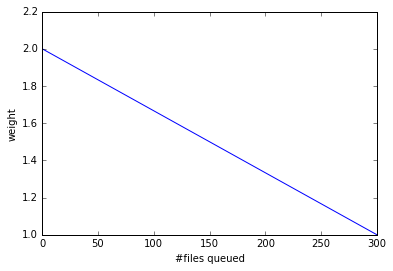
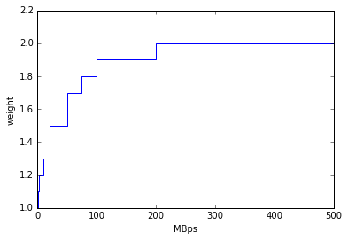

====================================
Brokerage
====================================

The brokerage is one of the most crucial functions in the system to distribute workload among computing resources.
It has the following goals:

* To assign enough jobs to computing resources to utilize all available CPUs continuously.

* To minimize the waiting time for each job to produce output data.

* To execute jobs in such a way that the jobs respect their priorities and resource allocations.

* To choose computing resources for each job based on characteristics of the job and constraints of the computing resources.

It is not straightforward to satisfy those goals for all jobs since some of them are logically contradictory.
The brokerage has a plugin structure so that organizations can provide their algorithms according to
their needs and use-cases.

This page explains the algorithms of some advanced plugins.

------------

|br|

ATLAS Production Job Brokerage
-------------------------------------

This is the general ATLAS production job brokerage flow:

#. Generate the list of preliminary candidates from one of the following:

   * All queues while excluding any queue with case-insensitive 'test' in the name.

   * A list of pre-assigned queues. Unified queues are resolved to pseudo-queues. Although merge jobs are pre-assigned
     to avoid transferring small pre-merged files, the pre-assignment is ignored if the relevant queues have been skipped
     for 24 hours.

#. Filter out preliminary candidates that don't pass any of the following checks:

   * The queue status must be *online* unless the queues are pre-assigned.

   * Skip queues if their links to the nucleus are blocked.

   * Skip queues if over the ``NQUEUED_SAT_CAP`` (defined in :doc:`gdpconfig </advanced/gdpconfig>`) files queued
     on their links to the nucleus.

   * Skip all queues if the number of files to be aggregated to the nucleus is larger than ``NQUEUED_NUC_CAP_FOR_JOBS``
     (defined in :doc:`gdpconfig </advanced/gdpconfig>`).

   * If priority :raw-html:`&GreaterEqual;` 800 or scout jobs, skip queues unless associated with the nucleus.

   * If priority :raw-html:`&GreaterEqual;` 800 or scout jobs or merging jobs or pre-merged jobs, skip inactive queues
     (where no jobs got started in the last 2 hours although activated jobs had been there).

   * Zero Share, which is defined in the ``fairsharepolicy`` field in CRIC. For example *type=evgensimul:100%*,
     in this case, only evgen or simul jobs can be assigned as others have zero shares.

   * If the task ``ioIntensity`` is larger than ``IO_INTENSITY_CUTOFF`` (defined in :doc:`gdpconfig </advanced/gdpconfig>`),
     the total size of missing files must be less than ``SIZE_CUTOFF_TO_MOVE_INPUT`` (defined in :doc:`gdpconfig </advanced/gdpconfig>`)
     and the number of missing files must be less than ``NUM_CUTOFF_TO_MOVE_INPUT`` (defined in :doc:`gdpconfig </advanced/gdpconfig>`).
     I.e., if a queue needs to transfer more input files, the queue is skipped.

   * There is a general ``MAX_DISKIO_DEFAULT`` limit in :doc:`gdpconfig </advanced/gdpconfig>`.
     It is possible to overwrite the limit for a particular queue through the ``maxDiskIO`` (in kB/sec per core)
     field in CRIC. The limit is applied in job brokerage: when the average diskIO per core for running jobs in
     a queue exceeds the limit, the next cycles of job brokerage will exclude tasks with ``diskIO`` higher than
     the defined limit to progressively get the diskIO under the threshold.

   * CPU Core count matching.

   * Availability of ATLAS release/cache. This check is skipped when queues have *ANY* in the ``releases`` filed in CRIC.
     If queues have *AUTO* in the ``releases`` filed, the brokerage uses the information published in a json by CRIC as
     explained at :ref:`this section <ref_auto_check>`.

   * Queues publish maximum (and minimum) memory size per core. The expected memory site of each job is estimated
     for each queue as

     .. math::

        (baseRamCount + ramCount \times coreCount) \times compensation

     where *compensation* is 0.9, avoiding sending jobs to high-memory queues when their expected memory usage is
     close to the lower limit. Queues are skipped if the estimated memory usage is not included in the acceptable
     memory ranges.

   * Skip queues if they don't support direct access to read input files from the local storage, although the task is
     configured to use only direct access.

   * The disk usage for a job is estimated as

     .. math::

        inputDiskCount + max (0.5 GB, outDiskCount \times nEvents) + workDiskCount

     where *inputDiskCount* is the total size of job input files, a discrete function of *nEvents*,
     and *nEvents* is the smalles1t number allowed based on the task requirements. *inputDiskCount* is zero
     if the queues are configured to read input files directly from the local storage. ``maxwdir`` is divided by
     *coreCount* at each queue and the resultant value must be larger than the expected disk usage.

   * DISK size check, free space in the local storage has to be over 200GB.

   * Skip blacklisted storage endpoints.

   * If scout or merge jobs, skip queues if their ``maxtime`` is less than 24 hours.

   * The estimated walltime for a job is

     .. math::

        \frac {cpuTime \times nEvents} {C \times P \times cpuEfficiency} + baseTime

     *nEvents* is the same as the one used to estimate the disk usage. The estimated walltime must be less than
     ``maxtime`` of the queue.

   * ``wnconnectivity`` of the queue must be consistent if the task specifies ``ipConnectivity``.
     The format of ``wnconnectivity`` and ``ipConnectivity`` is ``network_connectivity#ip_stack``.
     *network_connectivity* of the queue is

      * full: to accept any tasks since outbound network connectivity is fully available,

      * http: to accept tasks with *network_connectivity=http* or *none* since only http access is available, or

      * none: to accept tasks with *network_connectivity=none* since no outbound network connectivity is available,

     *ip_stack* of the queue is

      * IPv4: to accept tasks with *ip_stack=IPv4*,

      * IPv6: to accept tasks with *ip_stack=IPv6*, or

      * '' (unset): to accept tasks without specifying *ip_stack*.

   * Settings for event service and the dynamic number of events.

   * Too many transferring jobs: skip if transferring > max(transferring_limit, 2 x running), where transferring_limit limit is defined by site or 2000 if undefined.

   * Use only the queues associated with the nucleus if the task sets ``t1Weight=-1`` and normal jobs are being generated.

   * Skip queues without pilots for the last 3 hours.

   * If processingType=*urgent* or priority :raw-html:`&GreaterEqual;` 1000, the :ref:`Network weight <ref_network_weight>`
     must be larger than or equal to ``NW_THRESHOLD`` :raw-html:`&times;` ``NW_WEIGHT_MULTIPLIER``
     (both defined in :doc:`gdpconfig </advanced/gdpconfig>`).

#. Calculate brokerage weight for remaining candidates.
   The initial weight is based on running vs queued jobs.
   The brokerage uses the largest one as the number of running jobs among the following numbers:

   * The actual number of running jobs at the queue, *R*\ :sub:`real`.

   * min(*nBatchJob*, 20) if *R*\ :sub:`real` < 20 and *nBatchJob* (the number of running+submitted
     batch workers at PQ) > *R*\ :sub:`real`. Mainly for bootstrap.

   * *numSlots* if it is set to a positive number for the queue to the `proactive job assignment <https://github.com/HSF/harvester/wiki/Workflows#proactive-job-assignment>`_.

   * The number of starting jobs if *numSlots* is set to zero, which is typically useful for Harvester to fetch
     jobs when the number of available slots dynamically changes.

   The number of assigned jobs is ignored for the weight calculation and the subsequent filtering if the input for
   the jobs being considered is already
   available locally. Jobs waiting for data transfer do not block new jobs needing no transfer.

   .. math::

     manyAssigned = max(1, min(2, \frac {assigned} {activated}))

   .. math::

     weight = \frac {running + 1} {(activated + assigned + starting + defined + 10) \times manyAssigned}

   Take data availability into consideration.

   .. math::

     weight = weight \times \frac {availableSize + totalSize} {totalSize \times (numMissingFiles / 100 + 1)}

   Apply a :ref:`Network weight <ref_network_weight>` based on connectivity between nucleus and satellite,
   since the output files are aggregated to the nucleus.

   .. math::

     weight = weight \times networkWeight

#. Apply further filters.

   * Skip queues if activated + starting > 2 :raw-html:`&times;` running.

   * Skip queues if defined+activated+assigned+starting > 2 :raw-html:`&times;` running.

#. If all queues are skipped, the task is pending for 1 hour.
   Otherwise, the remaining candidates are sorted by weight, and the best 10 candidates are taken.

|br|

.. _ref_auto_check:

Release/cache Availability Check for releases=AUTO
=========================================================
Each queue publishes something like

.. code-block:: python

  "AGLT2": {
    "cmtconfigs": [
      "x86_64-centos7-gcc62-opt",
      "x86_64-centos7-gcc8-opt",
      "x86_64-slc6-gcc49-opt",
      "x86_64-slc6-gcc62-opt",
      "x86_64-slc6-gcc8-opt"
    ],
    "containers": [
      "any",
      "/cvmfs"
    ],
    "cvmfs": [
      "atlas",
      "nightlies"
    ],
    "architectures": [
      {
        "arch": ["x86_64"],
        "instr": ["avx2"],
        "type": "cpu",
        "vendor": ["intel","excl"]
      },
      {
        "type": "gpu",
        "vendor": ["nvidia","excl"],
        "model":["kt100"]
      }
    ],
    "tags": [
      {
        "cmtconfig": "x86_64-slc6-gcc62-opt",
        "container_name": "",
        "project": "AthDerivation",
        "release": "21.2.2.0",
        "sources": [],
        "tag": "VO-atlas-AthDerivation-21.2.2.0-x86_64-slc6-gcc62-opt"
      },
      {
        "cmtconfig": "x86_64-slc6-gcc62-opt",
        "container_name": "",
        "project": "Athena",
        "release": "21.0.38",
        "sources": [],
        "tag": "VO-atlas-Athena-21.0.38-x86_64-slc6-gcc62-opt"
      }
    ]
  }

Checks for CPU and/or GPU Hardware
^^^^^^^^^^^^^^^^^^^^^^^^^^^^^^^^^^^

The format of task ``architecture`` is ``sw_platform<@base_platform><#host_cpu_spec><&host_gpu_spec>`` where
``host_cpu_spec`` is ``architecture<-vendor<-instruction_set>>`` and
``host_gpu_spec`` is ``vendor<-model>``.
If ``host_cpu_spec`` or ``host_gpu_spec`` is specified, the ``architectures`` of the queue is checked.
The ``architectures`` can contain two dictionaries to describe CPU and GPU hardware specifications.
All attributes of the
dictionaries except for the *type* attribute take lists of strings. If 'attribute': ['blah'], the queue
accepts tasks with attribute='blah' or without specifying the attribute. If 'excl' is included in the list,
the queue accepts only tasks with attribute='blah'.
For example, tasks with *#x86_64* are accepted by queues with "arch": ["x86_64"], "arch": [""],
or "arch": ["x86_64", "excl"], but not by "arch": ["arm64"].

Checks for Fat Containers
^^^^^^^^^^^^^^^^^^^^^^^^^^^^^^

If the task uses a container, i.e., the ``container_name`` attribute is set, the brokerage checks as follows:

* If the task uses only tags, i.e., it sets ``onlyTagsForFC``, the ``container_name`` must be equal to
  the *container_name* of a tag in the ``tags`` list or must be included in the ``sources`` of a tag in
  the ``tags`` list.

* If the task doesn't set ``onlyTagsForFC``,

   * 'any' or '/cvmfs' must be included in the ``containers`` list, or

   * ``container_name`` must be forward-matched with one of the strings in the ``containers`` list, or

   * ``container_name`` is resolved to the source path using the dictionary of the "ALL" queue, and
     the resolved source path must be forward-matched with one of the strings in the ``containers`` list.

Checks for Releases, Caches, or Nightlies
^^^^^^^^^^^^^^^^^^^^^^^^^^^^^^^^^^^^^^^^^^^^^^^^

Checks are as follows for releases, caches, and nightlies:

* 'any' or *cvmfs_tag* must be included in the ``cvmfs`` list, where *cvmfs_tag* is *atlas* for
  standard releases and caches or *nightlies* for nightlies. In addition,

   * 'any' or '/cvmfs' must be included in the ``containers`` list, or

   * the task ``sw_platform`` is extracted from the task ``architecture`` and must be included in the ``cmtconfigs`` list.

* If the above is not the case, 'any' must be in the ``containers`` list and the task ``sw_platform``,
  ``sw_project``, and ``sw_version`` must be equal to ``cmtconfig``, ``project``, and ``release`` of a tag
  in the ``tags`` list.

|br|

.. _ref_network_weight:

Network Weight
==========================
The network data sources are

* the `Network Weather Service <http://atlas-adc-netmetrics-lb.cern.ch/metrics/latest.json>`_ as the dynamic source, and

* the `CRIC closeness <https://atlas-cric.cern.ch/api/core/sitematrix/query/?json&json_pretty=0>`_ as a semi static source.

Given the accuracy of the data and the timelapse from decision to action, the network weight only aims to provide
a simple, dynamic classification of links. It is currently calculated as:

.. math::

  netWorkWeight = 0.5 \times (queuedWeight + throughputWeight)

where the queued and throughput weight are calculated as in the plot below:

  queuedWeight

  throughputWeight

It uses the most recent available data, so preferably data of the last 1 hour, in not available of last 1 day,
if not available of last 1 week. FTS Mbps are used, which are filled from Chicago elastic search.
If there are no available network metrics, the AGIS closeness (0 best to 11 worst) is used in a normalized way

.. math::

  weightNwThroughput = 1+ \frac {MAX\_CLOSENESS - closeness} {MAX\_CLOSENESS - MIN\_CLOSENESS}

|br|