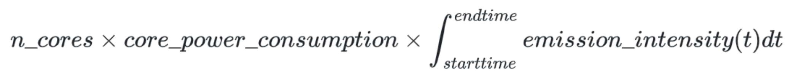

===========================
Estimation of PanDA job carbon footprint
===========================

1. Emission intensities of the power grids
------------------------------
PanDA periodically gathers data on the *regional* emission intensities (measured in CO2/kWh) of the power grids in
various regions where ATLAS Grid computing centers are operational. These regions can range from individual
countries (e.g. Europe) to states in larger countries (e.g. the USA). Emission intensities within a region
can vary throughout the day, depending on the energy sources available, such as solar, wind, oil, coal, or nuclear power.

Our primary source for regional emission intensity data is: https://www.co2signal.com/.

PanDA also combines these *regional* intensities to calculate a *global* emission intensity, which considers the contribution
of each region to the overall ATLAS Grid computing capacity.

2. Emission intensities of the power grids
------------------------------

In the next step, PanDA calculates the carbon footprint for each job using the following formula:

The *core_power_consumption* is currently a fixed estimate of the energy consumption of the hardware or computing center.
There is an option for sites to update this value in the CRIC information system, and over time, we aim to have
more accurate information.

The emission intensity is integrated over the job's runtime. We compute the carbon footprint of a job by considering
both the *regional* and *global* emission intensities.

3. Presentation of the carbon footprint information
------------------------------

We have the capability to aggregate carbon footprint data at various levels, including tasks, users, sites, and
the entire Grid. We are gradually incorporating this information into monitoring, accounting, and task summary emails.

As a general practice, users and task submitters will view estimates using the global emission intensity rather
than regional data. This choice is because users typically do not have control over the site selection, and
opting for a location with lower carbon intensity might not eliminate regions with higher emissions.

|br|
