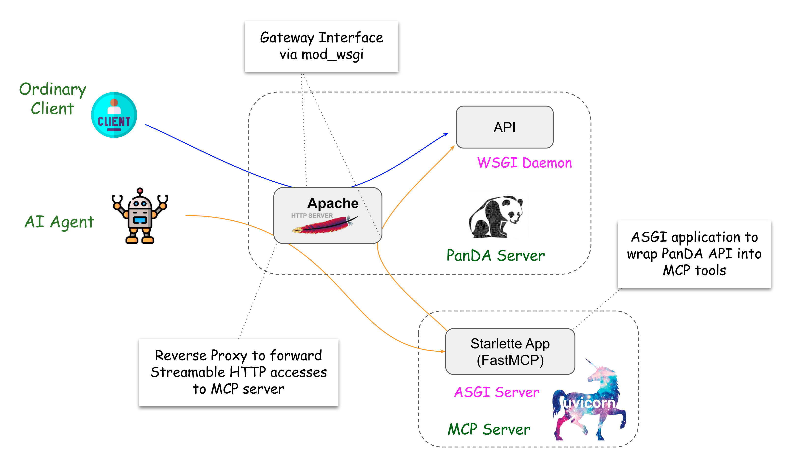
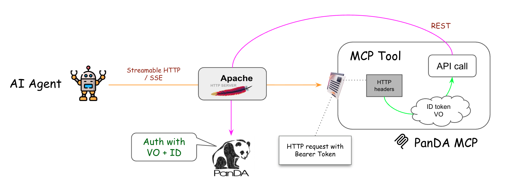

======================
Enabling PanDA MCP
======================

PanDA MCP (Media Context Protocol) turns PanDA Server's REST APIs into self-describing MCP tools that AI agents can query to access and manage jobs,
tasks, and system configurations.

|br|

The architecture of PanDA MCP is shown in the figure above. The PanDA Server exposes its REST APIs through WSGI interface to ordinary clients
such as end-users, Pilots, and Harvester. Requests from AI agents are forwarded to a MCP server, which translates them into REST API calls to
PanDA Server and returns the results. The MCP server is based on FastMCP and runs as an ASGI application through Uvicorn. This setup mainly comes
from the fact that
most of MCP servers are implemented as ASGI applications, while the PanDA Server is a WSGI application.

|br|

Authentication and Authorization in PanDA MCP
------------------------------------------------

FastMCP offers bearer token authentication and supports server compositions, consolidating multiple FastMCP servers into a unified main server.
However, only the main server can define an authentication provider,  which means that this setup supports only one authentication provider.
To accommodate multiple authentication providers, PanDA MCP delegates authentication and authorization to the PanDA Server.

The figure above shows how authentication and authorization work in PanDA MCP.
When an AI agent sends a request to the MCP server through the PanDA Server, the HTTP header should contains ``Authorization`` and ``Origin`` fields.

.. code-block:: http

    GET /mcp/blah HTTP/1.1
    ...
    Authorization: Bearer <ID token>
    Origin: <VO>

where ``<ID token>`` is an ID token issued by an identity provider trusted by the PanDA Server, and ``<VO>`` is the virtual organization name,
which is typically the same value set via PANDA_AUTH_VO when using panda-client.
When the request comes in, the PanDA Server forwards it to the MCP server without modification.
The MCP server then extracts these fields from the HTTP header and includes them in the REST API call back to the PanDA Server.
The PanDA Server finally validates the ID token and checks whether the user is authorized to access the requested resource.

|br|

-----------

Enabling PanDA MCP in PanDA Server
------------------------------------

To enable PanDA MCP in PanDA Server, you need to install ``uvicorn`` and ``fastmcp`` packages.

.. prompt:: bash

 /opt/panda/bin/pip install panda-server[mcp]

or

.. prompt:: bash

 /opt/panda/bin/pip install uvicorn fastmcp

Then, you need to add the following section in ``panda_server.cfg``:

.. code-block:: text

    [mcp]
    # transport protocol for MCP server, should be 'streamable-http' or 'sse'
    transport = streamable-http

    # the list of API endpoints to expose via MCP
    endpoint_list_file = /opt/panda/etc/panda/panda_mcp_endpoints.json

    # SSL settings (uncomment to enable SSL)
    # ssl_keyfile = /path/to/ssl_keyfile.pem
    # ssl_certfile = /path/to/ssl_certfile.pem

Note that SSL setting is required to enable SSL in the MCP server.
The file ``panda_mcp_endpoints.json`` contains the list of API endpoints to be exposed via MCP. It is a JSON file with the following format:

.. code-block:: json

    {
        "system": [
            "is_alive",
            "endpoint_path2",
            ...
        ],
        "API_module2": [
            "endpoint_path3",
            "endpoint_path4",
            ...
        ],
        ...
    }

All API endpoints are described on the `API documentation page <_static/panda_api.html>`_.

Make sure ``PANDA_SERVER_CONF_PORT_MCP`` is defined and ``HOME`` is defined without ~ in ``/etc/sysconfig/panda_server_env``, e.g.,

.. code-block:: text

    # Port number for MCP server
    PANDA_SERVER_CONF_PORT_MCP=25888

    # Home directory
    HOME=/home/atlpan

``httpd.conf`` needs to be configured to forward requests from AI agents to the MCP server:

.. code-block:: text

    ProxyPass /mcp/ http://127.0.0.1:${PANDA_SERVER_CONF_PORT_MCP}/mcp/
    ProxyPass /messages/ http://127.0.0.1:${PANDA_SERVER_CONF_PORT_MCP}/messages/
    ProxyPassReverse /mcp/ http://127.0.0.1:${PANDA_SERVER_CONF_PORT_MCP}/mcp/
    ProxyPassReverse /messages/ http://127.0.0.1:${PANDA_SERVER_CONF_PORT_MCP}/messages/
    ProxyPreserveHost On

in the HTTP ``VirtualHost`` section or

.. code-block:: text

    SSLProxyEngine on
    ProxyPass /mcp/ https://127.0.0.1:${PANDA_SERVER_CONF_PORT_MCP}/mcp/
    ProxyPass /messages/ https://127.0.0.1:${PANDA_SERVER_CONF_PORT_MCP}/messages/
    ProxyPassReverse /mcp/ https://127.0.0.1:${PANDA_SERVER_CONF_PORT_MCP}/mcp/
    ProxyPassReverse /messages/ https://127.0.0.1:${PANDA_SERVER_CONF_PORT_MCP}/messages/
    ProxyPreserveHost On
    SSLProxyVerify none
    SSLProxyCheckPeerCN off
    SSLProxyCheckPeerExpire off

in the HTTPS ``VirtualHost`` section if the MCP server enables SSL.

Then copy ``panda_mcp.service`` to ``/etc/systemd/system/``, enable the service, and start it.

.. prompt:: bash

    cp /opt/panda/etc/systemd/panda_mcp.service /etc/systemd/system/
    systemctl enable panda_mcp.service
    systemctl start panda_mcp.service

|br|

Testing PanDA MCP
------------------------------------

A simple way to test PanDA MCP is to use ``mcp_test_client.py`` in the PanDA Server package.

.. prompt:: bash

    python /opt/panda/lib/python3.11/site-packages/pandaserver/pandamcp/mcp_test_client.py -h

The script shows the list of available MCP tools, and tests a specific tool. E.g.,

.. prompt:: bash

    python /opt/panda/lib/python3.11/site-packages/pandaserver/pandamcp/mcp_test_client.py --tool is_alive --use_http --port 25080

|br|
