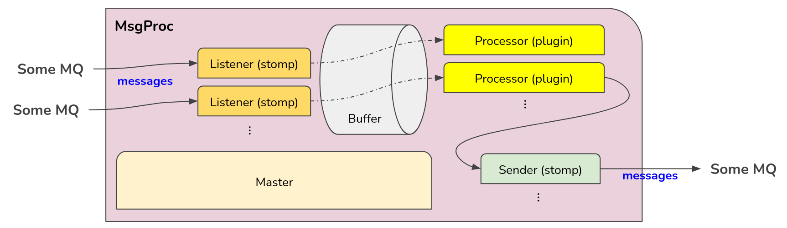

===================================
Messaging Mechanism
===================================

Messaging mechanism in PanDA WMS system, benefiting from MQ (message queue) service, provides enhancements for the system, by allowing quick communications with messages between PanDA server and JEDI, between iDDS and JEDI (and potentially between PanDA WMS and other external systems).

Before messaging mechanism developped in PanDA WMS, communicaitions among different agents and components only relied on the DB (PanDA database) - one unit updates the DB entries and the other unit polls the DB perioically to get the update and react. In this mechanism, the lataency due to polling periods can only be mitigated by shortening the cycle periods of agents, at the cost of (over)loading the DB.

With messaging mechanism, some communications between agents and components can come and go directly through MQ, without hitting the DB. Thus it reduces both the latency and DB load, which is useful in the cases of time-sensitive tasks (e.g. interactive analysis tasks or very short tasks) and of massive transient information to communicate (e.g. JEDI sending messages of status change of tasks to iDDS to trigger iDDS actions)

The backend MQ can be any message broker which supports STOMP protocol (e.g. ActiveMQ, Artemis, RabbitMQ, etc.).

Note that PanDA WMS system is still functional without messaging mechanism running (when messaging mechanism not configured)

The main components in the messaging mechanism are: message processors, message senders and backend MQ.

|br|

Message Processors
------------------

Message processsors are threads launched by the Message Processor agent, which is running on JEDI and keeps listening to the messages queues configured and waiting for new messages.
Message processsors only run when messages arrive, and take action according to the messages (aka processing the messages).

JEDI messages processors are plugin-based. New plugins can be added when new functionalities are required.
The message processor agent can be configured to listen to multiple message queues and to run different plugins.

The architecture in the message processor agent:

|br|

JEDI Configuration
""""""""""""""""""

The ``[msgprocessor]`` ``configFile`` parameter: Specify the path of the JSON configuration file for Message Processor agent. If commented, JEDI Message Processor agent will be disabled.

.. code-block:: text

    [msgprocessor]

    # json config file of message processors
    configFile = /etc/panda/jedi_msg_proc_config.json

JSON Configuration File
"""""""""""""""""""""""
The JSON configuration file (configured in ``[msgprocessor]`` ``configFile`` in JEDI configuration) is where to set up the message processor agents. An example:

.. code-block:: text

    {
    "mb_servers": {
        "iDDS_mb": {
            "host_port_list": ["some-mb.cern.ch:1234"],
            "use_ssl": false,
            "username": "<username>",
            "passcode": "<passcode>",
            "verbose": true
        },
        "rucio_mb": {
            "host_port_list": ["another-mb.cern.ch:5678"],
            "use_ssl": true,
            "cert_file": "/path/of/cert",
            "key_file": "/path/of/key",
            "vhost": "/"
        },
        "internal_mb": {
            "host_port_list": ["your-panda-internal-mb-server.cern.ch:61613"],
            "use_ssl": false,
            "username": "...",
            "passcode": "...",
            "send_heartbeat_ms": 15000,
            "vhost": "/"
        }
    },
    "queues": {
        "idds": {
            "server": "iDDS_mb",
            "destination": "/queue/Consumer.jedi.atlas.idds"
        },
        "rucio-events": {
            "server": "rucio_mb",
            "destination": "/queue/Consumer.panda.rucio.events"
        },
        "jedi_contents_feeder": {
            "server": "internal_mb",
            "destination": "/queue/jedi_contents_feeder",
            "max_buffer_len": 1,
            "buffer_block_sec": 1,
            "verbose": true
        },
        "jedi_job_generator": {
            "server": "internal_mb",
            "destination": "/queue/jedi_job_generator",
            "max_buffer_len": 1,
            "buffer_block_sec": 1,
            "verbose": true
        },
        "jedi_jobtaskstatus": {
            "server": "internal_mb",
            "destination": "/queue/jedi_jobtaskstatus",
            "ack_mode": "auto",
            "buffer_block_sec": 1
        }
    },
    "processors": {
        "atlas-idds": {
            "enable": true,
            "module": "pandajedi.jedimsgprocessor.atlas_idds_msg_processor",
            "name": "AtlasIddsMsgProcPlugin",
            "in_queue": "idds",
            "verbose": true
        },
        "panda-callback": {
            "enable": true,
            "module": "pandajedi.jedimsgprocessor.panda_callback_msg_processor",
            "name": "PandaCallbackMsgProcPlugin",
            "in_queue": "rucio-events"
        },
        "jedi-contents-feeder": {
            "enable": true,
            "module": "pandajedi.jedimsgprocessor.jedi_contents_feeder_msg_processor",
            "name": "JediContentsFeederMsgProcPlugin",
            "n_threads": 2,
            "in_queue": "jedi_contents_feeder"
        },
        "jedi-job-generator": {
            "enable": true,
            "module": "pandajedi.jedimsgprocessor.jedi_job_generator_msg_processor",
            "name": "JediJobGeneratorMsgProcPlugin",
            "n_threads": 2,
            "in_queue": "jedi_job_generator"
        },
        "push_jobtask_status": {
            "enable": true,
            "module": "pandajedi.jedimsgprocessor.status_report_msg_processor",
            "name": "StatusReportMsgProcPlugin",
            "n_threads": 2,
            "in_queue": "jedi_jobtaskstatus"
        }
    }
    }

In the JSON object, the configuration of **message broker servers**, **queues**, and **message processors** are defined.

**Message Broker Servers**

Defined under ``"mb_servers"`` object.
In the ``"mb_servers"`` object, a key can be any arbitrary name standing for the message broker server.
In the example above, there are 3 message broker servers, named "iDDS_mb", "rucio_mb" and "internal_mb".

Parameters of a message broker server\:

* ``"host_port_list"``: A list of host\:port of the message broker servers. If multiple host\:port are put in the list, only random one of them will be connected and the others will be failover candidates. Also in host\;port if a hostname is used instead of IP address, all IP addresses mapped to the hostname according to DNS resolution will be connected. Mandatory
* ``"use_ssl"``: STOMP option, whether to use SSL in authentication. Default is false
* ``"username"`` and ``"passcode"``: STOMP option, authenticate the message broker server with username and passcode. Default is null
* ``"cert_file"`` and ``"key_file"``: STOMP option, authenticate the message broker server with key/cert pair. Default is null
* ``"vhost"``: STOMP option, vhost of the message broker. Default is null
* ``"send_heartbeat_ms"`` and ``"recv_heartbeat_ms"``: STOMP option, send and receive hearbeat in microsecond, or 0 meaning not sending/receiving hearbeat. More information in `STOMP docs <https://stomp.github.io/stomp-specification-1.2.html#Heart-beating>`_ . Default is 60000 (10 minutes) for ``"send_heartbeat_ms"`` and 0 (do not want to receive) for ``"recv_heartbeat_ms"``
* ``"verbose"``: Whether to log verbosely about communication details with this message broker server. Default is false

**Queues**

Defined under ``"queues"`` object.
In the ``"queues"`` object, a key can be any arbitrary name standing for a message queue.
In the example above, there are 5 message queues: "idds", "rucio-events", "jedi_contents_feeder", "jedi_job_generator" and "jedi_jobtaskstatus".

Parameters of a message queue\:

* ``"server"``: Name of the message broker server defined under ``"mb_servers"`` for this message queue. Mandatory
* ``"destination"``: STOMP option, destination path on the message broker server for this message queue. Mandatory
* ``"enable"``: Whether to listen to this message queue. Useful when one needs to disable the queue temporarily but still wants to keep it the configuration file. Default is true
* ``"ack_mode"``: STOMP option, acknowledge mode for this message queue. Available modes are **auto**, **client** and **clien-individual**. More information in `STOMP docs <https://stomp.github.io/stomp-specification-1.2.html#SUBSCRIBE>`_ . Default is client-individual
* ``"max_buffer_len"``: Maximum queue length in the internal buffer before blocking fetch of new messages. Increasing this value may improve the performance by buffering messages, but setting this value to be too high risks losing messages when JEDI service is interrupted. In the cases that message loss is not tolerated, set the value to be 1. Default is 999
* ``"buffer_block_sec"``: Retry period in seconds to wait for blocking when ``"max_buffer_len"`` is reached. Decreasing this value may improve the performance by reducing wait time, at the cost of higher system load. Default is 10
* ``"use_transaction"``: Whether to enable transaction in STOMP. Using transaction provides better protection against message loss, at the risk of performance and overloading the MQ. More information in `STOMP docs <https://stomp.github.io/stomp-specification-1.2.html#BEGIN>`_ . Default is true
* ``"verbose"``: Whether to log verbosely about communication details with this message queue. Note that this value is ignored when verbose=true is set in the ``"mb_servers"`` section - logs will be verbose for all queues under the this message server. Default is false

**Message Processors**

Defined under ``"processors"`` object

In the ``"processors"`` object, a key can be any arbitrary name standing for a message processor.
A message processor running on JEDI consumes a message from a message queue and processes the message (and some message processor sends a new message to another message queue).
There are various message processor plugins for different workflows. All message processors available in JEDI are in the `message processor plugin repository <https://github.com/PanDAWMS/panda-jedi/tree/master/pandajedi/jedimsgprocessor>`_.

Parameters of a message processor\:

* ``"enable"``: Whether to enable this message processor. Useful when one needs to stop the message processor temporarily but still wants to keep it the configuration file. Default is true
* ``"module"`` and ``"name"``: Module and class name of the message processor plugin in JEDI. Mandatory
* ``"in_queue"``: Queue name defined under ``"queues"`` object, where the message processor consumes messages from this queue. Default is null
* ``"out_queue"``: Queue name defined under ``"queues"`` object, where the message processor sends messages to this queue. Not required if the processor does not send out messages. Default is null
* ``"params"``: A set of parameters for the message processor module (parameter definitions depend on the plugin) in JSON object format. Default is null
* ``"verbose"``: Whether to log verbosely about this message processor. Default is false

|br|

Message Senders
---------------

Message senders can be anything that send messages to the MQs from which the messages processors can receive messages.
Common message senders are functions in PanDA server and JEDI, or iDDS, or other external systems.

The messaging between PanDA server and JEDI (message senders are in PanDA server and JEDI) is called *internal messaging*.
Introduction of the configurations of message senders for internal messaging is shown below.

JEDI Configuration
""""""""""""""""""

The ``[mq]`` ``configFile`` parameter: Specify the path of the configuration file on JEDI for internal message queue . If commented, message sending activities in JEDI will be disabled.

.. code-block:: text

    [mq]

    # json config file of internal message queues
    configFile = /etc/panda/jedi_mq_config.json

PanDA server Configuration
""""""""""""""""""""""""""

The ``mq_configFile`` parameter: Specify the path of the configuration file on PanDA server for internal message queue . If commented, message sending activities in PanDA server will be disabled.

.. code-block:: text

    # json config file of message queues for PanDA functions to send to
    mq_configFile = /etc/panda/panda_mq_config.json

JSON Configuration File
"""""""""""""""""""""""
The JSON configuration file (configured in ``[mq]`` ``configFile`` on JEDI or ``mq_configFile`` on PanDA server) is where to set up the queue information for the message senders on JEDI or PanDA server. 

An example from JEDI:

.. code-block:: text

    {
    "mb_servers": {
        "internal_mb": {
            "host_port_list": ["your-panda-internal-mb-server.cern.ch:61613"],
            "use_ssl": false,
            "username": "...",
            "passcode": "...",
            "send_heartbeat_ms": 15000,
            "vhost": "/"
        }
    },
    "queues": {
        "jedi_contents_feeder": {
            "server": "internal_mb",
            "destination": "/queue/jedi_contents_feeder",
            "verbose": true
        },
        "jedi_job_generator": {
            "server": "internal_mb",
            "destination": "/queue/jedi_job_generator",
            "verbose": true
        },
        "jedi_jobtaskstatus": {
            "server": "internal_mb",
            "destination": "/queue/jedi_jobtaskstatus"
        }
    }
    }

An example from PanDA server:

.. code-block:: text

    {
    "mb_servers": {
        "internal_mb": {
            "host_port_list": ["your-panda-internal-mb-server.cern.ch:61613"],
            "use_ssl": false,
            "username": "...",
            "passcode": "...",
            "send_heartbeat_ms": 15000,
            "vhost": "/"
        }
    },
    "queues": {
        "panda_jobstatus": {
            "server": "internal_mb",
            "destination": "/queue/jedi_jobtaskstatus"
        }
    }
    }

In the JSON object, the configuration of **message broker servers** and **queues** are defined.

**Message Broker Servers**

Defined under ``"mb_servers"`` object.
In the ``"mb_servers"`` object, a key can be any arbitrary name standing for the message broker server.
In the example above, the "internal_mb" is configured, which is the default name for internal messaging.

Parameters of a message broker server\:

* ``"host_port_list"``: A list of host\:port of the message broker servers. If multiple host\:port are put in the list, only random one of them will be connected and the others will be failover candidates. Also in host\;port if a hostname is used instead of IP address, all IP addresses mapped to the hostname according to DNS resolution will be connected. Mandatory
* ``"use_ssl"``: STOMP option, whether to use SSL in authentication. Default is false
* ``"username"`` and ``"passcode"``: STOMP option, authenticate the message broker server with username and passcode. Default is null
* ``"cert_file"`` and ``"key_file"``: STOMP option, authenticate the message broker server with key/cert pair. Default is null
* ``"vhost"``: STOMP option, vhost of the message broker. Default is null
* ``"send_heartbeat_ms"`` and ``"recv_heartbeat_ms"``: STOMP option, send and receive hearbeat in microsecond, or 0 meaning not sending/receiving hearbeat. More information in `STOMP docs <https://stomp.github.io/stomp-specification-1.2.html#Heart-beating>`_ . Default is 60000 (10 minutes) for ``"send_heartbeat_ms"`` and 0 (do not want to receive) for ``"recv_heartbeat_ms"``
* ``"verbose"``: Whether to log verbosely about communication details with this message queue. Note that this value is ignored when verbose=true is set in the ``"mb_servers"`` section - logs will be verbose for all queues under the this message server. Default is false

**Queues**

Defined under ``"queues"`` object.
In the ``"queues"`` object, the key it the name standing for a message queue. The queue names depend on the senders (i.e. queue names *CANNOT* be arbitrary). For example, for PanDA/JEDI internal messaging the following queue names are used: "jedi_contents_feeder", "jedi_job_generator", "jedi_jobtaskstatus"

Parameters of a message queue\:

* ``"server"``: Name of the message broker server defined under ``"mb_servers"`` for this message queue. Mandatory
* ``"destination"``: STOMP option, destination path on the message broker server for this message queue. Mandatory
* ``"enable"``: Whether to listen to this message queue. Useful when one needs to disable the queue temporarily but still wants to keep it the configuration file. Default is true
* ``"verbose"``: Whether to log verbosely about communication details with this message queue. Note that this value is ignored when verbose=true is set in the ``"mb_servers"`` section - logs will be verbose for all queues under the this message server. Default is false

|br|