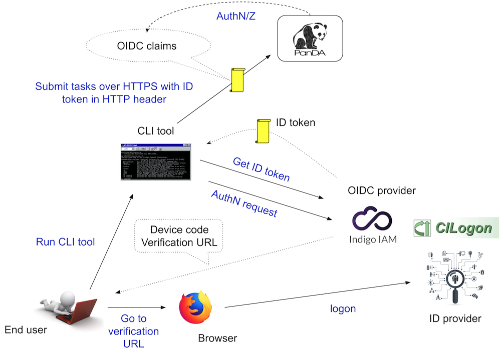

==================================
Identity and access management
==================================

PanDA has the identity and access management (IAM) scheme fully compliant with OIDC/OAuth2.0
capable of identity federation among scientific and academic identity providers.
Although legacy x509 is also supported, it is recommended to avoid it since it is being outdated.

PanDA IAM is consist of

* `Indigo IAM <https://indigo-iam.github.io/docs/v/current/>`_

* `CILogon <https://cilogon.org/>`_

* `Identity providers <https://cilogon.org/idplist/>`_

Indigo IAM is an account and group membership management service to define virtual organizations (VOs) and groups,
to add/remove users to/from VOs and groups, and issue ID tokens once users are authenticated.
CILogon is a federated ID broker to delegate authentication to ID providers such as CERN, BNL IT/SDCC, KIT,
Google, ...

The figure above shows the procedure of user authentication and authorization where the device code flow is used
to allow users to run command-line tools.
First, the user invokes a command-line tool which checks if a valid ID token is locally available.
If not, the command-line tool sends an authentication request to Indigo IAM on behalf of the user and retrieves
a verification URL. Then the user opens a web browser to go to the verification URL, and is eventually
redirected to his/her own ID provider through CILogon. Once the user successfully logs on, a couple
of tokens are exchanged between CILogon and Indigo IAM, and an ID token is issued. The command-line
tool gets the ID token and put it to the HTTP request header when accessing the PanDA server.
The PanDA server decodes the token and authorizes the user based on OIDC claims such as name, username, and groups.

DOMA PanDA IAM
---------------
There is an multipurpose IAM instance at `DOMA PanDA IAM <https://panda-iam-doma.cern.ch/login>`_
which can define any VO or group to play with PanDA.

PanDA server configuration
---------------------------

Client setup
---------------------
:ref:`client/panda-client:panda-client` needs to set the following environment variables to enable
OIDC/OAuth2.0 based Auth.

.. prompt:: bash

 export PANDA_AUTH=oidc
 export PANDA_AUTH_VO=<name of virtual organization>
 export PANDA_VERIFY_HOST=off

where *name of virtual organization* should be replaced with the actual VO name.
