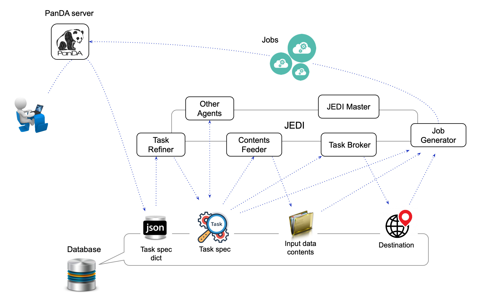
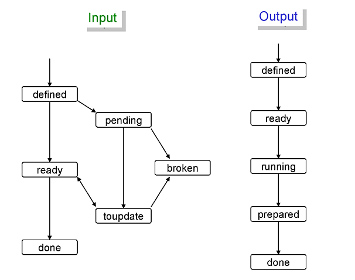
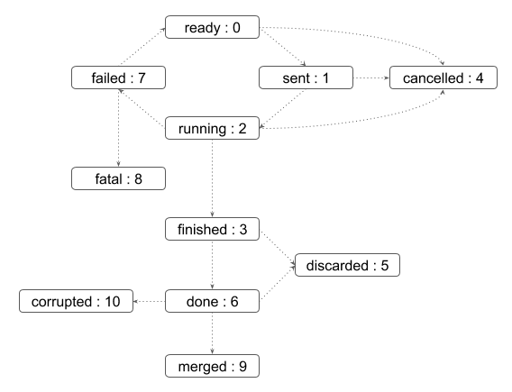

=====
JEDI
=====

JEDI (Job Execution and Definition Interface) is a high-level engine to dynamically tailor workload
for optimal usages of heterogeneous resources. It works with tasks to submit jobs to the PanDA server.
The main functions are as follows:

* To receive and parse task specifications which are fed into the system from clients through the RESTful
  interface of the PanDA server.
* To collect information about task input data.
* To decide the destination for each task output data.
* To choose compute resources based on characteristics and requirements of each task.
* To generate and assign jobs to compute resources by taking global shares into account.
* To reassign jobs if workload distribution becomes unbalanced among compute resources.
* To take actions on tasks according to various timeout configurations or user's commands.
* To finalize tasks once their input data are done.

JEDI is composed of a master process, stateless agents running on multiple threads/processes,
and a fine-grand exclusive lock mechanism.
Those agents run independently and they don't directly communicate with each other.
They take objects from the database, take actions on those objects, and update the database.
Each agent is designed around a plugin structure with the core core and experiment/activity-specific
plugins.

The exclusive lock mechanism allows operations to be distributed across threads, processes, and machines,
so that JEDI horizontally scales with multiple machines.
For example, it locks a task while an agent process is working on the task,
and prevent other agent processes on the same or other machines from updating the task, which is typically
useful to avoid inconsistent modifications caused by concurrently running processes.

The figure above shows the architecture of JEDI.
The details of the master process, agents, their functions, and important internal objects
are explained in the following sections.

.. contents::
    :local:
    :depth: 2

-------

|br|

JEDI Master
--------------
``JEDI Master`` is the main process of JEDI to launch other agents according to ``modConfig`` and
``procConfig`` specified in the configuration file.
There is only one ``JEDI Master`` process on each machine, and all agents independently run as child
processes of the ``JEDI Master``.
There are two connection pools in ``JEDI Master``, one for connections to the database backend
and the other for connections to an data management system,
and agents share connections in those pools.
The number of connections to the database or data management system is limited
even if their accesses are quite busy, so that those external services are protected.
When ``JEDI Master`` gets started it initializes connection pools first, launches agents,
give connection pools to agents, waits for the SIGTERM or SIGKILL signal, and kills
all agents and itself.

-------

|br|

Agents
--------------

Task Refiner
  Clients specify tasks in json dictionaries and feed them into the database through RESTful
  interface of the PanDA server.
  ``Task Refiner`` parses them to instantiate ``JediTaskSpec`` objects.
  Each ``JediTaskSpec`` object represents a task.
  The core code sets common attributes of ``JediTaskSpec`` while plugins set experiment/activity specific attributes.
  One of the important attributes is ``splitRule`` concatenating two-latter codes to specify
  various characteristics and requirements of the task.
  ``JediTaskSpec`` objects are inserted to the database once they are successfully instantiated.

Contents Feeder
  ``Contents Feeder`` retrieves the contents of input data, such as a list of data filenames,
  from the external data management service, and records them to the database for subsequent processing
  by other agents. If the input data is not a collection of data files, e,g, a list of random seeds,
  ``Contents Feeder`` records a list of pseudo files in the database.

Task Broker
  ``Task Broker`` decides final destinations of task output if tasks are specified to aggregate
  output but final destinations are undefined. It is skipped otherwise. The final destination
  is chosen for each site by taking into account its input data locality, free disk spaces and downtime
  of storage resources, transfer backlog over the network, and requirements on data processing.

Job Generator
  ``Job Generator`` is the busiest agent in JEDI. It chooses compute resources for each task,
  generates jobs, and submit them to the PanDA server. The details are described in the next section.

Post Processor
  Once tasks process all input data they are passed to ``Post Processor`` to be finalized.
  The post-processing step includes various procedures like validation, cleanup, and duplication
  removal of output data, dispatch of email notifications to task owners, to trigger processing
  of child tasks, and so on.

Watch Dog
  ``Watch Dog`` periodically takes actions throughout the task lifetime.

Task Commando
  Users send the following commands to JEDI through the RESTful interface of the PanDA server.
  ``Task Command`` takes actions based on those commands.

    * kill
       To kill a task. All running jobs of the task are killed.

    * finish
       To finish a task. There are two modes of this command. The soft finish command disables to generate new jobs
       for the task and waits until all running jobs are done, while the hard finish command kills all jobs and finishes
       the task immediately.

    * retry
       To retry a task. The task will process only input data which were unsuccessful in the previous attempt.
       Hopeless tasks such as broken and failed tasks reject the retry command since there is no reason to retry.

    * incexec
       To retry a task with a new task parameters after looking up the input data. This is typically useful
       when new data are appended to the input data and require changes some task parameters.

    * pause
       To pause processing of a task. This command disables to generate new jobs for the task and pause queued jobs.

    * resume
       To resume a paused task. This command enables to generate new jobs for the task and release paused jobs.

    * avalanche
       To skip the scouting state for a task. This commands changes the task status to running and triggers
       generation of remaining jobs for the task.

Message Processor
  ``Message Processor`` consumes messages sent from various external components through ActiveMQ.

Job Generator
^^^^^^^^^^^^^^^

``Job Generator`` is composed of ``Job Throttler``, ``Job Broker``, ``Job Splitter``, ``Task Setupper``,  and
the job submission code. It is highly parallelized since the performance of ``Job Generator``
directly affects the throughput of the whole system. It must scale well since a single task
can generate millions of jobs, for example.

The enter task pool is first partitioned by global share and resource requirements such as
the number of cores and memory size. Each ``Job Generator`` agent takes one partition
in a single processing cycle.
``Job Throttler`` runs in the agent and checks whether there are enough jobs running or queued on compute resources
for the partition.
If not, the agent spawns multiple threads. ``Job Broker`` running on each thread
takes one task in the partition based on its priority and select appropriate compute resources.
The selection algorithm considers data locality, requirements for data processing and transfers,
constraints and downtime of compute resources, and transfer backlog over the network.
If one or more compute resources are available ``Job Broker`` passes the task to ``Job Splitter``
which generates jobs to respect task requirements and various constraints of compute resources.
Finally the job submission code submits those jobs to the PanDA server after ``Task Setupper`` prepares
output data collections.
Then ``Job Broker`` takes the next task.
Once enough tasks are processed in the partition the threads are terminated and the
``Job Generator`` agent takes another partition.

--------

|br|

Internal objects
------------------

Task
^^^^^^^^^^^^^^
``JediTaskSpec`` represents a task. The status transition chart and explanations of task statuses are
available at :ref:`terminology/terminology:Task` section.

----

Dataset
^^^^^^^^^^^^^^^^^
``JediDatasetSpec`` represent a data collection, which is called a dataset.
The status transition charts of input and output datasets
are shown below.

Each dataset status is described as follows:

Input dataset
++++++++++++++

defined
    the dataset information is inserted to the database.
toupdate
    the dataset information needs to be updated.
pending
    the dataset is temporally unavailable.
broken
    the dataset is permanently unavailable.
ready
    the dataset is ready to be used.
done
    all files in the dataset were processed.

Output dataset
+++++++++++++++

defined
    the dataset information is inserted to the database.
ready
    the dataset is ready for the main processing.
running
    files are being added to the dataset,
prepared
    the dataset is ready for post-processing.
done
    the final status.

There are 6 types of datasets; input, output, log, lib, tmpl_output, and tmpl_log.
Log datasets contain log files produced by jobs. Lib datasets contains auxiliary input files
for jobs such as sandbox files that are not really data.
Tmpl_output and tmpl_log datasets are pseudo template datasets to instantiate intermediate datasets where
premerged output data files and log files are added to get merged later. Those pseudo datasets are used
only when tasks are specified to use the internal merge capability.

-----

File
^^^^^^^^^^^^^^^
``JediFileSpec`` represents a file. A dataset is internally represented as a collection of files.
Generally files are physical data files, but if tasks take other entities as input,
such as collections of random seeds, they are also represented as 'pseudo' files.
Files can be retied until they are successfully processed.
JEDI makes a new replica of the file object for each attempt and passes it to the PanDA
server, i.e., file objects in JEDI are master copies of file objects in the PanDA server,

The status transition charts of input and output files
are shown below.

.. figure:: images/jedi_file.png

Each file status is described as follows:

Input file
+++++++++++
ready
    the file information is correctly retrieved from DDM and is inserted to the JEDI_Dataset_Contents table
missing
    the file is missing in the cloud/site where corresponding task is assigned
lost
    the file was available in the previous lookup but is now unavailable
broken
    the file is corrupted
picked
    the file is picked up to generate jobs
running
    one or more jobs are using the file
finished
    the file was successfully used
failed
    the file was tried multiple times but not succeeded
partial
    the file was split at event-level and some of event chunks were successfully finished

Output file
++++++++++++
defined
    the file information is inserted to the JEDI_Dataset_Contents table
running
    the file is being produced
prepared
    the file is produced
merging
    the file is being merged
finished
    the file was successfully processed
failed
    the file was not produced or failed to be merged

-----

Event
^^^^^^^^^^^^^^
JEDI has a capability to keep track of processing at the sub-file level.
A file is internally represented as a collection of events.
``JediEventSpec`` represents an event which is the finest processing granularity.

The status transition chart of event and each event status
are shown below.

ready
    ready to be processed
sent
    sent to the pilot
running
    being processed on a worker node
finished
    successfully processed and the corresponding job is still running
cancelled
    the job was killed before the even range was successfully processed
discarded
    the job was killed in the merging state after the event range had finished
done
    successfully processed and waiting to be merged. The corresponding job went to a final job status.
failed
    failed to be processed
fatal
    failed with a fatal error or attempt number reached the max
merged
    the corresponding ES merge job successfully finished
corrupted
    the event is flagged as corrupted in order to be re-processed since corresponding zip file is problematic

---------

|br|
