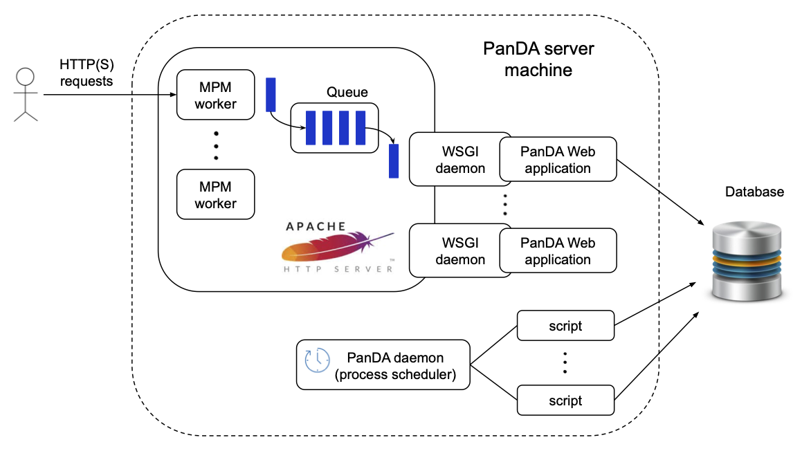
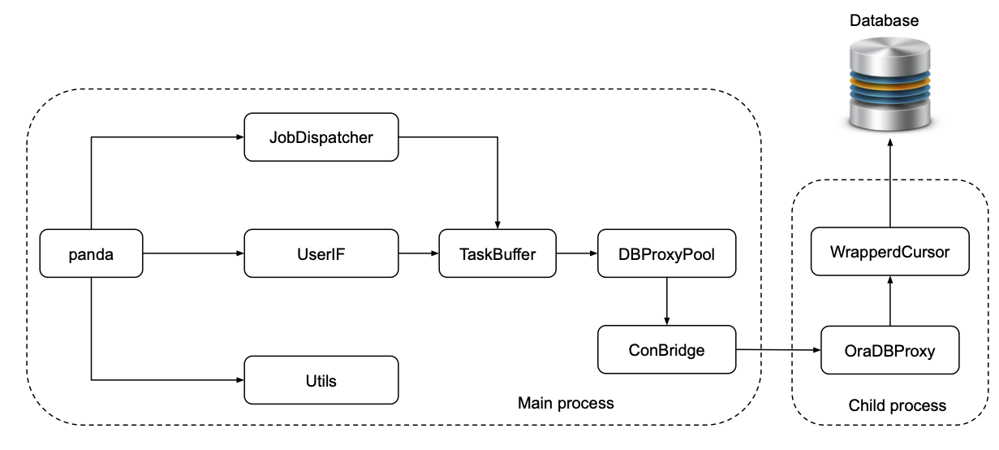

=================
PanDA server
=================

The PanDA server is the central hub of the system. It consists of Apache-based RESTful Web servers
and time-based process schedulers, running on the database.
It takes care of jobs throughout their lifetime. The main functions are as follows:

* To receive jobs from JEDI and other job sources that directly generate jobs mainly for testing purposes.
* To prepare job input data once input data are ready.
* To dispatch jobs to worker nodes.
* To watch jobs while they are running on worker nodes.
* To post-process job output data once jobs are done on worker nodes.
* To take actions on jobs according to various timeout configurations or user's commands.
* To report job updates to JEDI if those jobs were generated by JEDI.

The PanDA server horizontally scales
by adding machines since Web servers are stateless and time-based processes are
fine-grained.

The figure above shows the architecture of the PanDA server on a single machine.
PanDA Web applications are embedded in
WSGI daemons running behind an `Apache HTTP server <http://httpd.apache.org/>`_.
The master Apache process spawns WSGI
daemons via `mod_wsgi <https://modwsgi.readthedocs.io/en/master/>`_ in addition to
`Apache MPM workers <https://httpd.apache.org/docs/current/en/mod/worker.html>`_.
The number of WSGI daemons is static, while the number of MPM workers dynamically changes depending
on the load to optimize resource usages on the machine.
MPM workers receive requests from actors such as users and the pilot. The requests are passed
to PanDA Web applications through an internal request queue and WSGI daemons.
There are two types of requests:

* Synchronous requests: Actors are blocked for a while and receive responses when PanDA Web applications
  complete processing the requests.
* Asynchronous requests: Actors immediately receive a response and the requests are
  asynchronously processed. This is typically done when the requests invoke heavy procedures like access
  to external services. This mode avoids the HTTP server from being clogged.

When the entire PanDA server is composed of `M` machines receiving requests at rate `R` Hz and each PanDA server
machine runs `W` PanDA Web applications, the average processing time of the request is `A` sec, the following formula
must be satisfied:

.. math::

 A \times R < M \times W

Otherwise the HTTP server will be overloaded and requests will be terminated due to timeout errors.

The time-based process scheduler, so-called ``PanDA daemon``, is a daemon to launch various scripts periodically.
Its functionalities are very similar to the standard cron daemon, but it has the following advantages:

* No need to maintain an extra crontab config file.

* On each machine, the same script runs sequentially, i.e., only one process for each script,
  which is especially helpful when the script may run longer than the period configured.
  No new process will spawn until the existing one finishes, while the cron daemon blindly launches processes
  so that one has to fine-tune the frequency or let the script itself kill old processes to avoid duplicated execution.

* There is an exclusive control mechanism to prevent multiple machines from running the same script in parallel.
  If this is enabled for a script, only one machine can run the script at a time, which is
  useful for long-running scripts that can run on any machine.

* Better system resource usages, e.g., limited total processes ``n_proc`` to run scripts,
  reduction of the overhead to launch processes, and sharing of database connections among
  scripts to avoid making a new database connection in every run.

------------

|br|

PanDA Web application
----------------------

The figure above shows the internal architecture of the PanDA Web application to process
synchronous requests. The ``panda`` module is the entry point of the PanDA Web application running in the
main process and implementing
the WSGI protocol to receive requests through the WSGI daemon.
Requests are fed into one of three modules, ``JobDispatcher``, ``UserIF``, and ``Utils``.

``JobDispatcher`` and ``UserIF`` modules provide APIs for the pilot and users, respectively, and
requests via those modules end up with the database access through ``TaskBuffer``, ``OraDBProxy``, and other
modules.

On the other hand, the ``Utils`` module
provides utility APIs which don't involve database access, such as API for file uploading.

``TaskBuffer`` and ``OraDBProxy`` modules provide high-level and low-level APIs for the database access
respectively. They are executed in separate processes and communicate through the ``ConBridge``
module. The ``ConBridge`` module allows the child process, which runs the ``OraDBProxy`` module, to get
killed due to timeout to avoid deadlock of the main process. One ``ConBridge`` object talks to
one ``OraDBProxy`` object.

The ``OraDBProxyPool`` is a pool of ``ConBridge`` objects where the ``TaskBuffer`` module picks up one
``ConBridge`` object to call ``OraDBProxy`` APIs.

The ``WrappedCursor`` module implements Python DB-API 2.0 interface to allow uniform access to various
database backends and establishes one connection to the database. If ``OraDBProxyPool`` is configured
to have `C` ``ConBridge`` objects, the total number of database connections in all PanDA Web applications
is statically

.. math::

 M \times W \times C

When a group of jobs is submitted through ``UserIF``, the PanDA Web application spawns another type of child process
running the ``Setupper`` module.  In this case, ``Setupper`` will prepare their input data, such as data registration,
trigger the data distribution and so on. Those preparation procedures are experiment-dependent so that the
``Setupper`` has a plugin structure to load an experiment-specific plugin.

------------------

|br|

PanDA daemon
--------------------------------------------

PanDA daemon launches the following scripts.
The execution frequency can be configured for each script.

add_main
   A script to post-process jobs' output data after those jobs received the final heartbeat from the pilot.

add_sub
   A script to run high-frequency procedures.

configurator
   A script to fetch information about compute, storage, and network resources from the experiment's information service.

copyArchive
   A script to take actions on jobs based on various timeout configurations.

datasetManager
   A script to take actions on input and output data of jobs.

panda_activeusers_query
   A script to cache user's credentials.

tmpwatch
   A script to clean-up temporary files.

---------------

|br|

Other PanDA modules
-----------------------
Other modules are mainly used to process asynchronous requests.
 * The ``Setupper`` module prepares the input data, such as data registration, triggers the data distribution and so on. Those preparation procedures are experiment-dependent
   so that the Setupper has a plugin structure to load an experiment-specific plugin.
  * Registers a destination data block (if not yet registered)
  * Sub-destination data block is created per a bunch of jobs
  * Registers sub-destination data block
  * A dispatch data block is defined by Brokerage using prod data block
  * Registers a dispatch data block
 * The ``Activator`` module changes job status from `assigned` to `activated` when input data of the job is ready (based on DDM feedback).
 * The ``Adder`` module is the core for `add_main` to post-process jobs' output data,
   such as data registration, trigger data aggregation and so on. Those post-processing procedures are experiment-dependent
   so that the ``Adder`` also has a plugin structure to load an experiment-specific plugin. It registers the output file.
  * Retrieves XML from pilot
  * Retrieves LFN/GUID in JSON
  * Adds files to destination data block and sub-destination data block
 * The ``Watcher`` module checks whether jobs are getting heartbeats and kills them due to lost-heartbeat errors if not.
 * The ``Closer`` module works on collections of output data once jobs are done on worker nodes. It finishes the destination data blocks.
  * Counts the number of files in a sub-destination data block
  * Closes a sub-destination data block when the number reaches to the expected number
 * The ``Finisher`` module finalizes jobs.

Roughly speaking, jobs go through ``UserIF`` :raw-html:`&rarr;` ``Setupper`` :raw-html:`&rarr;`
``Activator`` :raw-html:`&rarr;` ``JobDispatcher`` (:raw-html:`&rarr;` ``Watcher``) :raw-html:`&rarr;`
``Adder`` :raw-html:`&rarr;` ``Closer`` :raw-html:`&rarr;` ``Finisher``.
Note that they don't always pass on-memory job objects directly to subsequent modules.
For example, the ``Setupper`` module leaves job objects in the database, and then
the ``Activator`` module retrieves the job objects from the database when launched in another process.

-----

|br|
