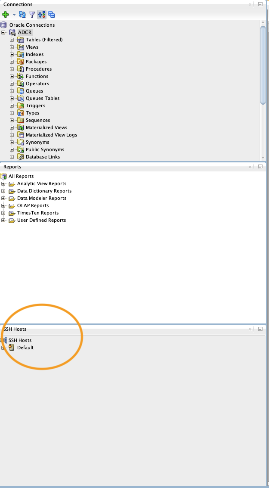
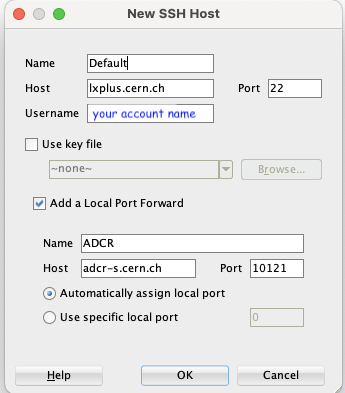
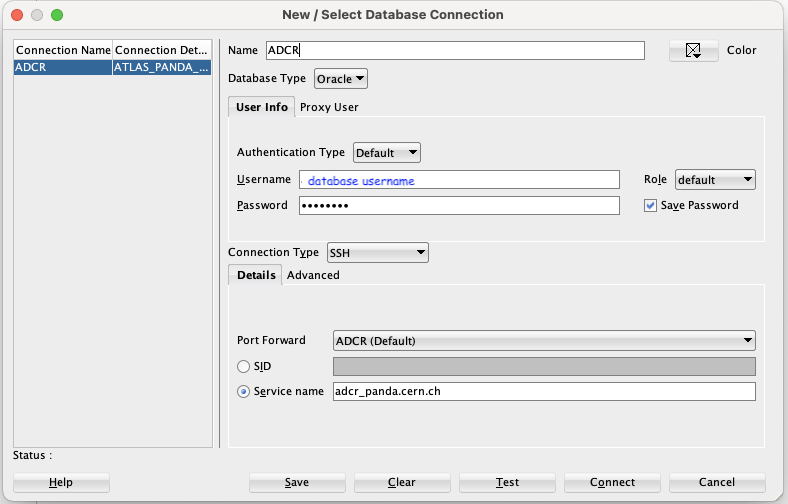

==================================
Central Services Operations corner
==================================

Links
---------------

* Puppet templates: https://gitlab.cern.ch/ai/it-puppet-hostgroup-vopanda
* PanDA configurations: https://gitlab.cern.ch/ai/it-puppet-module-vopandaconfig
* CSOps managed machines: https://atlas-adcmon.cern.ch/cmdb/

Commands
---------------

Disable, enable, run puppet with logging in the foreground:

.. prompt:: bash

 puppet agent --disable 'reason for disabling puppet'
 puppet agent --enable
 puppet agent -t

Take a PanDA server out of load balancing and put it back in:

.. prompt:: bash

 touch /etc/iss.nologin  # take out of load balancing
 rm /etc/iss.nologin     # put back in load balancing

Check the status and configuration of the logrotate service:

.. prompt:: bash

 systemctl list-timers | grep logrotate
 cat /etc/systemd/system/logrotate.timer

Myproxy for PanDA ProxyCache
~~~~~~~~~~~~~~~~~~~~~~~~~~~~

For ATLAS Robot proxy certificate of atlpilo1 and atlpilo2 are in use. Examples below are for atlpilo1.

CSOps manages an automatic renewal script that runs in acrontab of `atlpilo1` or `atlpilo2`. You can see check them like this:

.. prompt:: bash

    ssh root@<harvester instance>
    su -l atlpilo1
    /usr/sue/bin/kinit -kt /data/atlpilo1/keytab atlpilo1@CERN.CH 
    acrontab -l

.. code-block:: none

 ...
 #check and upload atlpilo2 proxy in myproxy
 00 09 * * * lxplus-acron.cern.ch /afs/cern.ch/user/a/atlpilo2/.globus/renew_myproxy.sh > /afs/cern.ch/user/a/atlpilo2/my_proxy.log 2>&1
 ...

You can try to check or renew the proxy manually. In case myproxy is not installed, install it first:

.. prompt:: bash

    yum install myproxy

Check myproxy info:

.. prompt:: bash

    myproxy-info -s myproxy.cern.ch -l '/DC=ch/DC=cern/OU=Organic Units/OU=Users/CN=atlpilo1/CN=614260/CN=Robot: ATLAS Pilot1'

Reinitialize myproxy:

.. prompt:: bash

    myproxy-init -s myproxy.cern.ch -x -Z '/DC=ch/DC=cern/OU=Organic Units/OU=Users/CN=pandasv1/CN=663551/CN=Robot: ATLAS Panda Server1' -d -k panda -c 4383 -t 0 -C ~/.globus/atlpilo1_latest_x509up.rfc.proxy -y ~/.globus/atlpilo1_latest_x509up.rfc.proxy;

Access to Oracle database via SQL Developer
~~~~~~~~~~~~~~~~~~~~~~~~~~~~~~~~~~~~~~~~~~~~~~
Accessing the ATLAS Oracle database is restricted to within CERN's network.
If you need to connect from outside, you'll have to establish an SSH tunnel.
Here's how to set it up in  in `SQL Developer <https://www.oracle.com/database/sqldeveloper/>`_.
Note that there are compatibility issues with SQL Developer and SSH tunnelling on MacOS with M1 chips as of early 2024.

First, navigate to the SSH panel in SQL Developer  [View -> SSH].
Once there, you'll see a panel similar to the one shown below.

Right-click on "SSH Hosts" to add a new SSH connection, as demonstrated in the following image.
Use your lxplus account username.

Then, head to the Connections panel and click the green plus sign to add a new connection.
Fill in the required details, such as the database username and password, as shown in the following image.

Once connected, right-click on the connection and select "Schema Browser" to explore the tables
in ATLAS_PANDA, ATLAS_PANDAARCH, and other schemas.