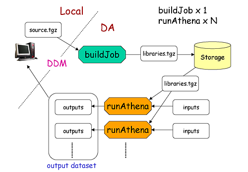
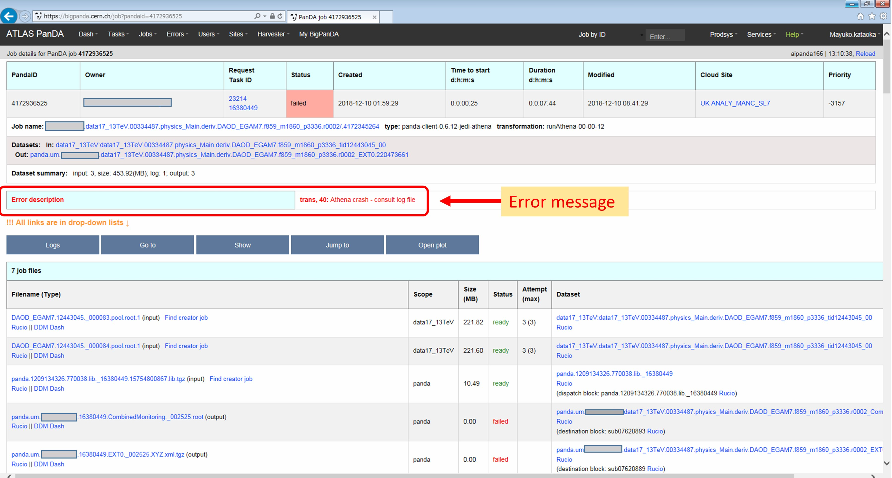
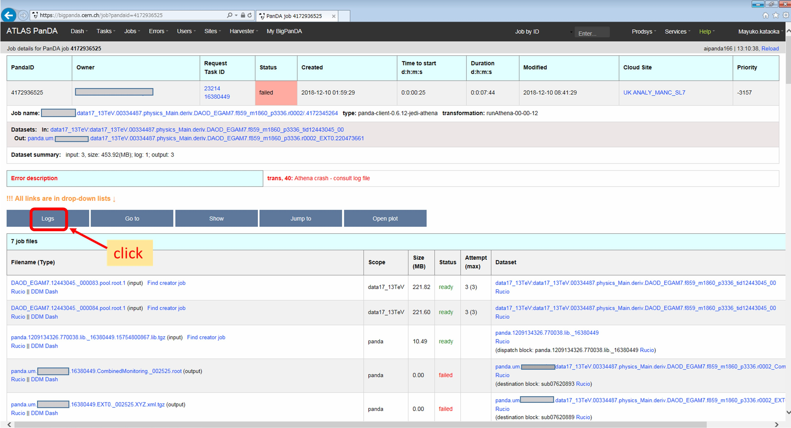
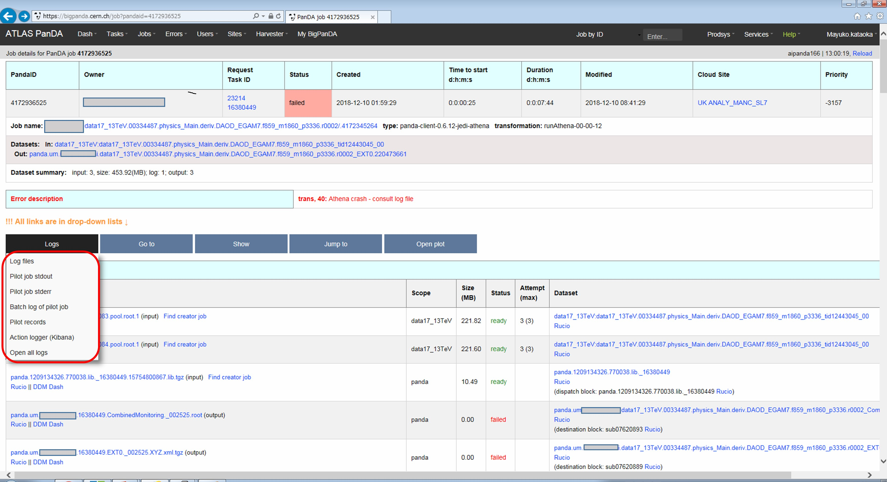
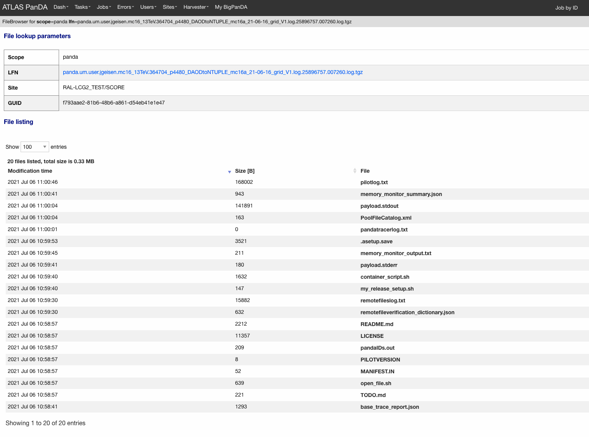
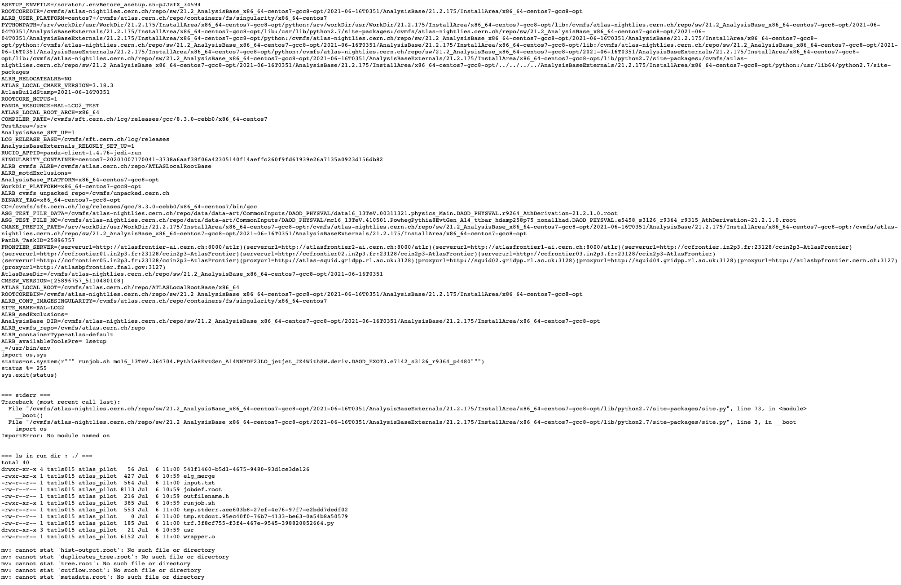

===========================
Running Athena analysis
===========================

This page explains how to run Athena analysis on PanDA.

.. contents:: Table of Contents
    :local:

-----------

|br|

Preparation
============

First you need to setup the runtime environment of Athena which you want to use on PanDA.
Here is an example with AnalysisBase,21.2.40

.. prompt:: bash

 export ATLAS_LOCAL_ROOT_BASE=/cvmfs/atlas.cern.ch/repo/ATLASLocalRootBase
 alias setupATLAS='source ${ATLAS_LOCAL_ROOT_BASE}/user/atlasLocalSetup.sh'
 setupATLAS
 asetup AnalysisBase,21.2.40,here

Checkout packages, add modifications, and build them if necessary.
Make sure that your Athena job runs properly.

Then you need to setup panda-client.

.. prompt:: bash

  lsetup panda

Once everything is done you can try

.. prompt:: bash

 pathena --helpGroup ALL

to see all available options.

--------------

|br|

How to run
============

Running jobOptions
--------------------

When you run Athena with

.. prompt:: bash

 athena jobO_1.py jobO_2.py jobO_3.py

all you need is

.. prompt:: bash

 pathena jobO_1.py jobO_2.py jobO_3.py <--inDS inputDataset> --outDS outputDataset

where ``--inDS`` takes a dataset, a dataset container name, or a comma-concatenated list
of input dataset/container names if the job read input data,
while ``--outDS`` takes the base name of output dataset containers.
``pathena`` parses jobOptions to define output types, collects various environment variables,
makes a relocatable sandbox file from your local built packages to recreate your local runtime environment
on remote resources, and submits a task together with those materials to PanDA.
``EventSelector.InputCollections`` is automatically set to read files from ``--inDS`` so that
you don't have to change anything in your jobOptions files.
One output dataset container is created for each output type and is registered in rucio.
If you want to monitor your task, see :doc:`Monitoring </client/monitoring>`.
Once your task is done you will get an email notification, then you can download output
files using rucio client. Your output files are available for 30 days.
If you want to retry your task, see :doc:`Bookkeeping </client/pbook>`.

--------------

|br|

Running transformations
-------------------------

The ``--trf`` option of ``pathena`` allows users to run official transformations such as Reco_tf.py
with customized packages. The option takes an execution string which can be created as follows:
If you locally run a trf like

.. prompt:: bash

 Reco_tf.py inputAODFile=AOD.493610._000001.pool.root.1 outputNTUP_SUSYFile=my.NTUP.root"

replace some parameters with *%XYZ* using the following table

.. list-table::
   :header-rows: 1

   * - Parameter
     - Placeholder
   * - Input
     - %IN
   * - Cavern Input
     - %CAVIN
   * - Minimumbias Input
     - %MININ
   * - Low pT Minimumbias Input
     - %LOMBIN
   * - High pT Minimumbias Input
     -  %HIMBIN
   * - BeamHalo Input
     - %BHIN
   * - BeamGas Input
     - %BGIN
   * - Output
     - %OUT + suffix (e.g., %OUT.ESD.pool.root)
   * - MaxEvents
     - %MAXEVENTS
   * - SkipEvents
     - %SKIPEVENTS
   * - FirstEvent
     - %FIRSTEVENT
   * - DBRelease or CDRelease
     - %DB:DatasetName:FileName (e.g., %DB:ddo.000001.Atlas.Ideal.DBRelease.v050101:DBRelease-5.1.1.tar.gz. %DB:LATEST if you use the latest DBR). Note that if your trf uses named parameters (e.g., DBRelease=DBRelease-5.1.1.tar.gz) you will need DBRelease=%DB:DatasetName:FileName (e.g., DBRelease=%DB:ddo.000001.Atlas.Ideal.DBRelease.v050101:DBRelease-5.1.1.tar.gz)
   * - Random seed
     - %RNDM:basenumber (e.g., %RNDM:100, this will be incremented per sub-job)

Then you just need to give the string to ``--trf``, e.g.

.. prompt:: bash

 pathena --trf "Reco_trf.py inputAODFile=%IN outputNTUP_SUSYFile=%OUT.NTUP.root" --inDS ... --outDS ...

When your trf doesn't take an input (e.g., evgen), use the ``--split`` option to specify how many jobs you need.
``%SKIPEVENTS`` may be needed if you use the ``--nEventsPerJob`` or ``--nEventsPerFile`` options of pathena.
Otherwise, some jobs will run on the same event range in the same input file.

Note that you may need to explicitly specify *maxEvents=XYZ* or something in the execution string to set the number
of events processed in each job, since the value of ``--nEventsPerJob`` or ``--nEventsPerFile``
is used only to split files, but is not appended to the execution string.
Otherwise, each job will process all events in the input file.

``pathena`` doesn't interpret the argument for the --trf option although it replaces *%XYZ*.
It is user's responsibility to consistently specify pathena options and the execution string.

If you want to add parameters to the transformation that are not listed above, just add them to the execution string.
``pathena`` doesn't replace anything except *%XYZ*, but it passes these parameters along to the transformation
just the same.

--------------

|br|

Running multiple transformations
---------------------------------

One can run multiple transformations in a job by using semicolons in the ``--trf`` option like

.. prompt:: bash

 pathena --trf "trf1.py ...; trf2.py ...; trf3.py ..." ...

Here is an example to run simul+digi;

.. prompt:: bash

  pathena --trf "AtlasG4_trf.py inputEvgenFile=%IN outputHitsFile=tmp.HITS.pool.root maxEvents=10 skipEvents=0 randomSeed=%RNDM geometryVersion=ATLAS-GEO-16-00-00 conditionsTag=OFLCOND-SDR-BS7T-04-00; Digi_trf.py inputHitsFile=tmp.HITS.pool.root outputRDOFile=%OUT.RDO.pool.root maxEvents=-1 skipEvents=0 geometryVersion=ATLAS-GEO-16-00-00  conditionsTag=OFLCOND-SDR-BS7T-04-00" --inDS ...

where AtlasG4_trf.py produces a HITS file (tmp.HITS.pool.root) which is used as an input by Digi_trf.py to produce RDO.
In this case, only RDO is added to the output dataset since only RDO has the %OUT prefix (i.e. %OUT.RDO.pool.root).

If you want to have HITS and RDO in the output dataset the above will be

.. prompt:: bash

 pathena --trf "AtlasG4_trf.py inputEvgenFile=%IN outputHitsFile=%OUT.HITS.pool.root maxEvents=10 skipEvents=0 randomSeed=%RNDM geometryVersion=ATLAS-GEO-16-00-00 conditionsTag=OFLCOND-SDR-BS7T-04-00; Digi_trf.py inputHitsFile=%OUT.HITS.pool.root outputRDOFile=%OUT.RDO.pool.root maxEvents=-1 skipEvents=0 geometryVersion=ATLAS-GEO-16-00-00  conditionsTag=OFLCOND-SDR-BS7T-04-00" --inDS ...

Note that both AtlasG4_trf.py and Digi_trf.py take %OUT.RDO.pool.root as a parameter.
AtlasG4_trf.py uses it as an output filename while Digi_trf.py uses it as an input filename.

--------------

|br|

FAQ
=======

Contact
----------

We have one egroup and one JIRA. Please submit all your help requests to hn-atlas-dist-analysis-help@cern.ch
which is maintained by AtlasDAST.

How PanDA chooses sites where jobs run?
----------------------------------------

PanDA chooses sites using the following information;

* input data locality
* the number of jobs in activated/defined/running state (site occupancy rate)
* the average number of CPUs per worker node at each site
* the number of active or available worker nodes
* pilot rate for last 3 hours. If no pilots, the site is skipped
* available disk space in SE
* Atlas release/cache matching
* site statue

and then calculate the weight for each site using the following formula.

.. math::

  W = \frac{(1+G/(U+1)) * (R+1) * P * X}{D+A+T}

where

* W: Weight at the site
* G: The number of available worker nodes which have sent getJob requests for last 3 hours
* U: The number of active worker nodes which have sent updateJob requests for last 3 hours
* R: The maximum number of running jobs in last 24 hours
* D: The number of defined jobs
* A: The number of activated or starting jobs
* T: The number of assigned jobs which are transferring input files to the site
* X: Weight factor based on data availability. When input file transfer is disabled, X=1 if input data is locally available, otherwise X=0. When input file transfer is enabled, X=1+(total size of input files on DISK)/10GB if files are available on DISK, X=1+(total size of input files on TAPE)/1000GB if files are available on TAPE, X=1 otherwise

What are buildJob and runJob?
------------------------------

Once PanDA chooses sites to run jobs the relocatable sandbox file is sent to the sites. One buildJob is created
at each site to upload the sandbox file to the local storage at the site.
The completion of buidJob triggers a bunch of runJobs. Each runJob retrieves the sandbox file to run Athena.

It is possible to skip buildJob using ``--noBuild``. In this case runJobs retrive the sandbox file from
a web service but the size of the sandbox file is limted to 50MB.

How job priorities are calculated?
-------------------------------------
Job priorities are calculated for each user by using the following formula.
When a user submits a task composed of M jobs,

.. math::

  Priority(n) = 1000 - \frac{T+n}{5}

where Priority(n) is the priority of n-th job (0≤n<M), and the total number of the user's active jobs
in the whole system.

For example, if a fresh user submits a task composed of 100 jobs, the first 5 jobs have priority=1000
while the last 5 jobs have priority=981. The idea of this gradual decrease is to prevent huge tasks
from occupying the whole CPU slots. When another fresh user submits a job with 10 jobs, these jobs
have priority=1000,999 so that they will be executed as soon as CPU becomes available even if other users
have already queued many jobs. Priorities for waiting jobs in the queue are recalculated every 20 minutes.
Even if some jobs have very low priorities at the submission time their priorities are increased periodically
so that they are executed before they expire.

If the user submits jobs with the ``--voms`` and ``--official`` options to produce group datasets, those jobs
are regarded as group jobs. Priorities are calculated per group separately from the user who submitted, so group
jobs don't reduce priorities of normal jobs which are submitted by the same user without those options.

There are a few kinds of jobs which have higher priorities, such as merge jobs (5000) and HummerCloud jobs (4000),
since they have to be processed quickly.

How can I send jobs to the site which holds the most number of input files?
-----------------------------------------------------------------------------
You can send jobs to a specific site using ``--site``, but the option is not recommended,
since Jobs should be automatically sent to proper sites.

Why is my job pending in activated/defined state?
-----------------------------------------------------
Jobs are in the activated state until CPU resources become available at the site.
If the site is busy your jobs will have to wait so long.
runJobs are in defined state until corresponding buildJobs have finished.

How jobs get reassigned to other sites? Why were my jobs reassigned by JEDI?
--------------------------------------------------------------------------------
Jobs are internally reassigned to another site at most 3 times, when

* they are waiting for 24 hours.
* HammerCloud set sites to the test or offline mode 3 hours ago

The algorithm for site selection is the same as normal brokerage described in the above section.
Old jobs are closed. When a new site is not found, jobs will stay at the original site.

How to debug failed jobs
---------------------------
You can see the error description in :doc:`Monitoring </client/monitoring>`.

When transExitCode is not zero, the job failed with an Athena problem.
You may want to see log files. You can browse the log files following links "Logs" → "Log files".

Now you find various log files shown in the page.

E.g., there should be payload.stdout
for stdout and payload.stderr for stderr, where you may get some clues.

Note that some filed jobs don't have log files. This typically happens when jobs are killed by the batch system
before uploading log files.

Why did my jobs crash with "sh: line 1: XYZ Killed"?
-------------------------------------------------------

.. code-block:: text

  sh: line 1: 13955 Killed                  athena.py -s ...

If you see something like the above message in the log file, perhaps your jobs were killed by
the batch system due to huge memory consumption. You may explicitly reduce the number of input files per job
using ``--nFilesPerJob`` if memory consumption scales with the number of files. However, not set a very small
number to ``--nFilesPerJob``. If your jobs are very short the system will automatically ignore ``--nFilesPerJob``
since too many short jobs kill the system.

Why were my jobs closed ? What does 'upstream job failed' mean?
-------------------------------------------------------------------

If a buildJob fails, corresponding runJobs will get closed.

Are there any small samples to test my job before run it on the whole dataset?
--------------------------------------------------------------------------------

You can limit the number of files to be used in ``--inDS`` by using ``--nfiles``.

What is the meaning of the 'lost heartbeat' error?
----------------------------------------------------

Each job sends heartbeat messages every 30 min to indicate it is alive. If there is no heartbeat message for 6 hours,
the job gets killed.
The error typically happens when the job died due to temporary troubles in the backend batch system or network.
Generally jobs are automatically retried and the next attempts succeed.

What is the meaning of the 'Looping job killed by pilot' error?
--------------------------------------------------------------------
If a job doesn't update output files for 2 hours, it will be killed.
This protection is intended to kill dead-locked jobs or infinite-looping jobs.
If your job doesn't update output files very frequently (e.g., some heavy-ion job takes
several hours to process one event) you can relax this limit by using the --maxCpuCount option.
However, sometimes even normal jobs get killed due to this protection. When the storage element
has a problem, jobs cannot copy input files to run Athena and of course cannot update output files.
When you think that your job was killed due to an storage problem, you may report to DAST.
Then shift people and the SE admin will take care of it.

I want to process the whole dataset with N events per job. (integer N>0)
--------------------------------------------------------------------------

Use ``--nEventsPerJob``. This option checks with Rucio to retrieve the information about the number
of events for each file. Generally the information is available for official datasets.
You may have to register the information for private datasets if you want to use them.

I want to launch M jobs, each with N events per job
-------------------------------------------------------

You can use the following command:

.. prompt:: bash

 pathena --split M --nEventsPerJob N .....

Note that ``--nFilesPerJob`` and ``--nEventsPerJob`` can not be defined simultaneously, pathena
will exit with an error at startup. Please define only one or another.

Expected output file does not exist
---------------------------------------

Perhaps the output stream is defined in somewhere in your jobOs, but nothing uses it. In this case,
Athena doesn't produce the file. The solutions could be to modify your jobO or to use the ``--supStream`` option.
E.g., --supStream hist1 will disable user.aho.TestDataSet1.hist1._00001.root.

How to make group datasets
------------------------------------

Use ``--official`` and ``--voms`` options.

.. prompt:: bash

 pathena --official --voms atlas:/atlas/groupName/Role=production --outDS group.groupName.[otherFields].dataType.Version ...

where groupName for SUSY is phys-susy, for example.
See the document `ATL-GEN-INT-2007-001 <https://cds.cern.ch/record/1070318>`_ for dataset naming convention.
The group name needs to be officially approved and registered in ATLAS VOMS. Note that you need to have the production role
for the group to produce group-defined datasets. If not, please request it in the ATLAS VO registration page.
If you submit tasks with the ``--voms`` option, jobs are counted in the group's quota.

How do I blacklist sites when submitting tasks?
------------------------------------------------

Use ``--excludedSite``. However, this option is not recommend since that would skew workload distrubution in the
whole system and decrease the system throughput.

How do I get the output dataset at my favorite destination automatically
---------------------------------------------------------------------------

When ``--destSE`` option is used, output files are automatically aggregated to a RSE. e.g.,

.. prompt:: bash

 pathena --destSE LIP-LISBON_LOCALGROUPDISK ...

Generally LOCALGROUPDISK (long term storage) or SCRATCHDISK (short term storage) can be used.
You can check permission in each RSE page in CRIC. For example, only /atlas/pt users are allowed to write to
LIP-LISBON_LOCALGROUPDISK, so if you don't belong to the pt group the above example will fail and you will have
to choose another RSE.

pathena failed due to "ERROR : Could not parse jobOptions"
------------------------------------------------------------

The error message would be something like:

.. code-block:: python

    ABC/XYZ_LoadTools.py", line 65, in <module>
        input_items = pf.extract_items(pool_file=
    svcMgr.EventSelector.InputCollections[0])
    IndexError: list index out of range
    ERROR : Could not parse jobOptions

First, make sure that you jobOptions work on your local computer **without any changes**.
Basically pathena doesn't work if Athena locally fails with the jobO.

For example, if it fails in InputFilePeeker, the solution is to have something like

.. code-block:: python

 svcMgr.EventSelector.InputCollections=["/somedir/mc08.108160.AlpgenJimmyZtautauNp0VBFCut.recon.ESD.e414_s495_r635_tid070252/ESD.070252._000001.pool.root.1"]

in your jobO, where the input file must be valid (i.e. can be accessed from your local computer).
Note that input parameter (essentially EventSelector.InputCollections and AthenaCommonFlags.FilesInput)
will be automatically overwritten to read input files in ``--inDS``.

The local file doesn't have to be from ``--inDS`` as long as
the data type, such as AOD,ESD,RAW..., is identical.

-------------

|br|
