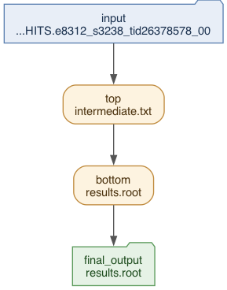
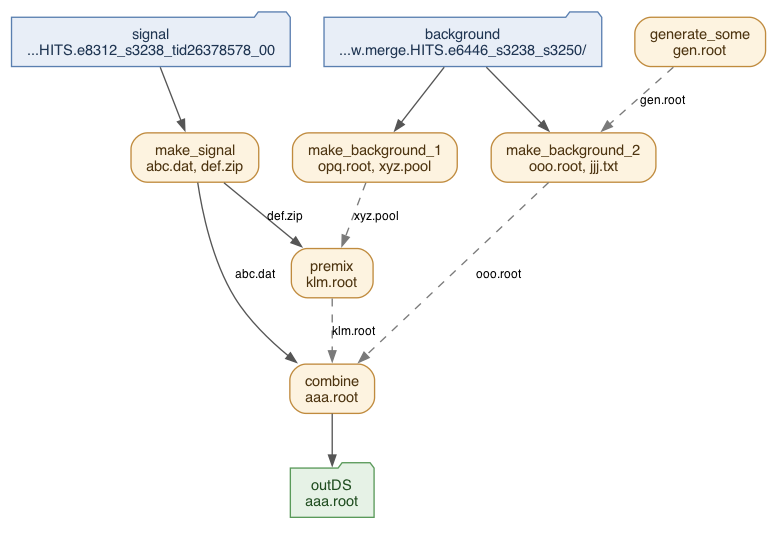
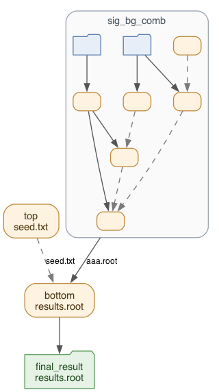
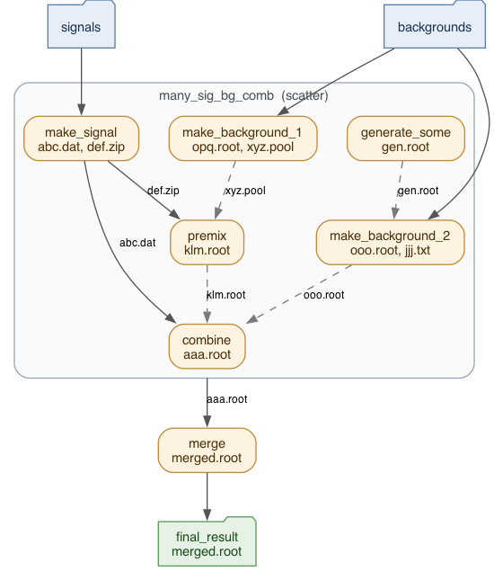
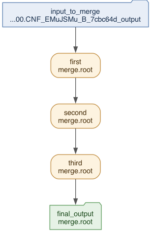

=========================
PanDA Native Workflow
=========================

A workflow is a set of tasks whose relationship is described with a directed acyclic graph (DAG),
where each edge is directed from a parent task to a child task that processes the output data of
the parent.

The *PanDA native workflow* is an implementation of workflows that runs entirely inside the PanDA
server. The user describes the workflow in a single yaml file, the **workflow description** (WFD),
and submits it with ``pchain_native``. The server parses the description, registers the workflow,
its steps and its data in the PanDA database, and drives the execution with its own workflow
engine.

The native description language is deliberately close to the ``prun`` command line, so that a step
is essentially one ``prun`` invocation plus the wiring that says where its input comes from.
Currently steps are PanDA tasks submitted through ``prun``, or sub-workflows.

:orange:`Remark: the native workflow is a recent addition and is still evolving. The description
language documented on this page covers plain DAGs, nested sub-workflows and scatter.`

.. contents:: Table of Contents
    :local:

-----------

|br|

Quick start
^^^^^^^^^^^^^^^^^^^^^^

Write a workflow description, e.g. :brown:`my_chain.yaml`, and submit it from the directory that
contains it together with any script that the steps execute.

.. tabs::

   .. code-tab:: bash ATLAS users

      $ pchain_native --wfd my_chain.yaml --outDS user.<your_nickname>.blah

   .. code-tab:: bash DOMA users

      $ pchain_native --wfd my_chain.yaml --outDS user.<your_nickname>.blah \
         --vo wlcg --prodSourceLabel test --workingGroup ${PANDA_AUTH_VO}

``pchain_native`` packs all files under the current directory that are smaller than
``--maxSizeInSandbox`` (1 MB by default) into a sandbox, uploads it, and sends the workflow
request to the PanDA server. The workflow description itself, any yaml file it references, and
the executables that the steps run must therefore live in that directory tree.

``--outDS`` is the basename of the datasets for output and log files. On success the server
replies with the ``workflow_id`` that identifies the workflow.

To see all options of ``pchain_native``

.. prompt:: bash

  pchain_native --helpGroup ALL

|br|

The workflow description
^^^^^^^^^^^^^^^^^^^^^^^^^^^^^

A workflow description is a yaml file with the following top-level sections.

.. list-table::
   :header-rows: 1

   * - Section
     - Description
   * - name
     - Name of the workflow, shown in monitoring. Optional
   * - inputs
     - Named input data of the workflow. Each entry is a dataset name, or a list of dataset names
       when it is used for scatter. Can be empty
   * - outputs
     - Named final output data of the workflow. Each entry has a ``from`` field pointing to the
       output of a step, and an optional ``output_types`` list
   * - steps
     - The steps of the workflow, i.e. the nodes of the DAG. Mandatory
   * - options
     - Workflow-level options. Optional
   * - workflow_blocks
     - Named sub-workflow definitions that steps in the same file can reference. Optional

Steps are given as a mapping from an arbitrary step name to the step definition. The type of a
step is given in the ``type`` field and defaults to :brown:`prun`. A ``prun`` step takes the
following fields.

.. list-table::
   :header-rows: 1

   * - Field
     - Corresponding prun option
   * - inDS
     - ---inDS (string)
   * - inDsType
     - No correspondence. Type of inDS (string)
   * - secondaryDSs
     - ---secondaryDSs (a list of strings)
   * - secondaryDsTypes
     - No correspondence. Types of secondaryDSs (a list of strings)
   * - exec
     - ---exec (string)
   * - containerImage
     - ---containerImage (string)
   * - useAthenaPackages
     - ---useAthenaPackages (bool)
   * - args
     - all other prun options except for those listed above (string)

Essentially,

.. code-block:: yaml

    steps:
      top:
        type: prun
        exec: "echo %RNDM:10 > seed.txt"
        args: "--outputs seed.txt --nJobs 3"

corresponds to

.. code-block:: bash

  prun --exec "echo %RNDM:10 > seed.txt" --outputs seed.txt --nJobs 3

The usual ``prun`` placeholders are available. :hblue:`%IN` in ``exec`` and ``args`` is expanded to
the list of filenames in the input dataset given in ``inDS``, :hblue:`%IN2`, :hblue:`%IN3`, ... to
the filenames of the secondary inputs, :hblue:`%{DSn}` to the name of the n-th input dataset,
:hblue:`%{SECDSn}` to the name of the n-th secondary dataset, and :hblue:`%RNDM:n` to a random
number.

|br|

Wiring steps together
==========================

There are only two reference forms in the language, and they are what turns a list of steps into
a DAG.

.. list-table::
   :header-rows: 1

   * - Reference
     - Meaning
   * - :hblue:`{name}`
     - The workflow input :brown:`name` declared in the ``inputs`` section
   * - :hblue:`step/outDS`
     - The output data of the step :brown:`step`

For example

.. code-block:: yaml

    inputs:
      raw: mc16_valid:mc16_valid.900248.PG_singlepion_flatPt2to50.simul.HITS.e8312_s3238_tid26378578_00

    steps:
      first:
        inDS: "{raw}"
        ...
      second:
        inDS: first/outDS
        ...

makes :blue:`second` a child of :blue:`first`, since :blue:`second` consumes what :blue:`first`
produces. Note that :hblue:`{raw}` has to be quoted, since a bare ``{`` starts a flow mapping in
yaml.

The same references are used in ``secondaryDSs`` and in the ``from`` field of the workflow
``outputs``. A step is a *tail* of the workflow when one of the workflow outputs refers to it.

A step has at most one primary input, given in ``inDS``, and the task is split over its files so
that each job gets a slice of them, reachable as :hblue:`%IN` in ``exec``. Everything listed in
``secondaryDSs`` is a secondary input: it does not drive the splitting, each job gets the number
of files declared for it, and they are reachable as :hblue:`%IN2`, :hblue:`%IN3`, and so on.
Both kinds make the source step a parent, so the child waits for either.

If a parent step produces several types of output data and the child needs only some of them,
the types are selected with ``inDsType`` for the primary input and with ``secondaryDsTypes``
for the secondary inputs, positionally matching the entries of ``secondaryDSs``. The stream name,
the number of files per job, etc, for each secondary input are given with :hblue:`---secondaryDSs`
in ``args``, where :hblue:`%{SECDSn}` is the placeholder for the n-th secondary dataset name.

|br|

Reading the pictures
==========================

The workflow pictures on this page all use the same conventions.

.. list-table::
   :header-rows: 1

   * - In the picture
     - Meaning
   * - Rounded box
     - A step, labelled with its name and the output types it produces
   * - Folder, blue at the top / green at the bottom
     - An entry of the workflow ``inputs`` / ``outputs`` section
   * - :brown:`Solid` arrow
     - A primary input: the target step names the source in its ``inDS``
   * - :brown:`Dashed` arrow
     - A secondary input: the target step lists the source in its ``secondaryDSs``
   * - Label on an arrow
     - The output type the child selects, i.e. its ``inDsType`` or ``secondaryDsTypes`` entry
   * - Enclosing box
     - A sub-workflow, labelled with the name of the step that runs it

Where a sub-workflow has its own picture elsewhere, the enclosing box shows only the shape of it,
with the text of its steps and inputs left out.

|br|

Output dataset names
==========================

Each step is assigned a sequential number within its workflow, in topological order, and the
output dataset of a step is named after the combination of ``--outDS``, that number and the step
name. The actual dataset in DDM appends the output file type, i.e.

.. code-block:: text

    <outDS>_<NNN>_<step_name>_<output_type>

For example, with :hblue:`---outDS user.<your_nickname>.blah` the :blue:`top` step of the simple
chain below writes to :brown:`user.<your_nickname>.blah_001_top_intermediate.txt`. If
:hblue:`---outputs` in ``args`` is a comma-separated list, one dataset is created for each output
type. The naming of steps inside sub-workflows is described in the corresponding sections below.

|br|

Data availability and partial inputs
=========================================

A child step starts once the data it consumes are considered available. By default the workflow
engine waits until the parent step is done, or until all output collections of the parent are
closed and non-empty, so that the child sees the complete input.

That behaviour can be relaxed per workflow in the ``options`` section, so that a child starts
while its parent is still running and both run in parallel for a while, which reduces the total
execution time of the workflow.

.. list-table::
   :header-rows: 1

   * - Option
     - Default
     - Description
   * - allow_partial_inputs
     - false
     - Let a step start when its input data are only partially available
   * - min_input_files
     - 10
     - With ``allow_partial_inputs``, the minimum number of files required before a step starts

.. code-block:: yaml

    options:
      allow_partial_inputs: true
      min_input_files: 50

|br|

Workflow examples
^^^^^^^^^^^^^^^^^^^^^^

Simple chain
======================

The following description is a parent-child chain of two ``prun`` tasks.

.. literalinclude:: native_workflow/wfd/simple_chain.yaml
    :language: yaml
    :caption: simple_chain.yaml

The workflow takes one input, :blue:`input`, which is consumed by the :blue:`top` step through the
:hblue:`{input}` reference. :blue:`bottom` chains on the output of :blue:`top` with the
:hblue:`step/outDS` reference, which is what makes it a child of :blue:`top`. The workflow output
:blue:`final_output` points at the output of :blue:`bottom` and declares :brown:`results.root` as
its type, so :blue:`bottom` is the tail of the workflow.

Both steps are plain ``prun`` invocations, with :hblue:`%IN` expanded to the filenames of the input
each job gets. :blue:`bottom` starts processing once :blue:`top` has produced enough output data,
waits if everything currently available has been processed while :blue:`top` is still running, and
finishes once all data from :blue:`top` is processed.

Submit it with

.. prompt:: bash

  pchain_native --wfd simple_chain.yaml --outDS user.<your_nickname>.blah

which produces :brown:`user.<your_nickname>.blah_001_top_intermediate.txt` and
:brown:`user.<your_nickname>.blah_002_bottom_results.root`.

|br|

More complicated chain
========================

Steps can have several parents and several children, and the description below shows a workflow
with two independent branches merging into a final step.

.. literalinclude:: native_workflow/wfd/signal_background_combine_wfd.yaml
    :language: yaml
    :caption: signal_background_combine_wfd.yaml

The workflow takes two inputs, :blue:`signal` and :blue:`background`. The :blue:`signal` is used
as input for the :blue:`make_signal` step, while the :blue:`background` is used as input for the
:blue:`make_background_1` and :blue:`make_background_2` steps. :blue:`generate_some` has no input
at all and only generates data.

:blue:`make_signal` runs in the busybox container given in ``containerImage`` and produces two
types of output data, :brown:`abc.dat` and :brown:`def.zip`, as declared in :hblue:`---outputs`.
Its children pick the type they need: :blue:`premix` takes :brown:`def.zip` through ``inDsType``,
while :blue:`combine` takes :brown:`abc.dat`.

:blue:`premix` additionally reads :brown:`xyz.pool` from :blue:`make_background_1` as a secondary
input, and :blue:`combine` reads the outputs of both :blue:`premix` and :blue:`make_background_2`
as secondary inputs. Since :blue:`combine` is referenced by the workflow output, it is the tail of
the workflow.

To run the same workflow over different input data it is enough to edit the ``inputs`` section
and resubmit.

|br|

Nested workflow
======================

A workflow can be used as a step of another workflow. Such a step has :brown:`workflow` in its
``type`` field, and the workflow it runs is either referenced by file name or written inline.

The reference form points at another yaml file in the sandbox with ``workflow_ref``. In the
picture the sub-workflow is drawn as structure only, since its steps are the ones already shown
in the previous section.

.. literalinclude:: native_workflow/wfd/nested_workflow_sig_bg_comb_wfd.yaml
    :language: yaml
    :caption: nested_workflow_sig_bg_comb_wfd.yaml

The :blue:`sig_bg_comb` step runs the whole :brown:`signal_background_combine_wfd.yaml` shown in
the previous section once, using the inputs declared in that file. Both files must be in the
sandbox, i.e. next to each other in the submission directory. ``workflow_ref`` can also name an
entry of a ``workflow_blocks`` section in the same file, if you prefer to keep everything in one
place.

Although a sub-workflow step runs many tasks, the rest of the description treats it exactly like
an ordinary step: it has a single output, :hblue:`sig_bg_comb/outDS`, which downstream steps
consume. Under the hood, the outputs of the tail steps of the sub-workflow are aggregated into a
DDM container named after the sub-workflow step, and that container is what :blue:`bottom` reads.

The same workflow can be written with the sub-workflow inlined in the ``steps`` field of the
sub-workflow step, which then carries its own ``inputs``, ``outputs`` and ``steps`` sections.

.. literalinclude:: native_workflow/wfd/nested_workflow_inline_sig_bg_comb_wfd.yaml
    :language: yaml
    :caption: nested_workflow_inline_sig_bg_comb_wfd.yaml

The two forms are equivalent and give the DAG pictured above. A separate file is reusable across
workflows and keeps the parent description short, while the inline form keeps a one-off
sub-workflow self-contained in a single file.

References inside a sub-workflow are resolved in the scope of the sub-workflow, so
:hblue:`{signal}` binds to the ``inputs`` of the sub-workflow, not to those of the parent, and
:hblue:`make_signal/outDS` refers to the sub-workflow step of that name. The numbering of output
datasets follows the nesting, i.e. the steps of the sub-workflow :blue:`sig_bg_comb`, which is
step 002 of the outer workflow, write to

.. code-block:: text

    user.<your_nickname>.blah_002_001_make_signal_abc.dat
    user.<your_nickname>.blah_002_002_make_background_1_opq.root
    ...

and the aggregated output of the sub-workflow step itself is
:brown:`user.<your_nickname>.blah_002_sig_bg_comb_aaa.root`.

Sub-workflows can be nested to arbitrary depth, with each level adding a segment to the name.

|br|

Scatter workflow
======================

A popular use-case is to perform the same analysis chain on many samples in a single workflow.
This is expressed by scattering a sub-workflow over lists of inputs: the sub-workflow is
instantiated once per element, and all the instances run in parallel. The picture shows the
sub-workflow once, as it is described; at runtime the whole box is instantiated twice.

.. literalinclude:: native_workflow/wfd/scatter_sig_bg_comb_wfd.yaml
    :language: yaml
    :caption: scatter_sig_bg_comb_wfd.yaml

The workflow declares two lists, :blue:`signals` and :blue:`backgrounds`, in its ``inputs``
section. The :blue:`many_sig_bg_comb` step references the same
:brown:`signal_background_combine_wfd.yaml` as before, and its ``scatter_inputs`` field maps the
inputs of that sub-workflow onto those lists

.. code-block:: yaml

    scatter_inputs:
      signal: signals          # sub-workflow input : parent input list
      background: backgrounds
    scatter_mode: zip

``scatter_mode`` is :brown:`zip`, which pairs the lists element-wise, i.e. iteration *i* runs the
sub-workflow with :hblue:`signals[i]` and :hblue:`backgrounds[i]`. Two instances therefore run
here. :brown:`zip` is currently the only supported mode; if the lists have different lengths, the
shortest one determines the number of iterations. Contrary to an ordinary sub-workflow, the values
coming from the parent replace the inputs declared in the sub-workflow file, which are then unused.

The output of a scatter step aggregates the outputs of all its iterations, so the downstream
:blue:`merge` step, which reads :hblue:`many_sig_bg_comb/outDS`, sees the results of every sample
and produces the final output.

Output datasets of the iterations carry both the number of the scatter step and the index of the
iteration, e.g. the :blue:`make_signal` step of the second iteration writes to
:brown:`user.<your_nickname>.blah_001s2_001_make_signal_abc.dat`.

|br|

Using workflow templates
^^^^^^^^^^^^^^^^^^^^^^^^^^^^^

Some workflows are so regular that writing the description by hand is pure boilerplate. For those,
``pchain_native`` ships templates that generate the workflow description on the fly, so that the
user only has to name the template and give its parameters.

.. prompt:: bash

  pchain_native --template <template_name> --inDS <input_dataset> --outDS user.<your_nickname>.blah

``--template`` is mutually exclusive with ``--wfd``. The generated description is written to a
temporary yaml file in the current directory, packed into the sandbox, and removed afterwards.
Run with ``-v`` to see the name of the generated file and what the template decided.

Template parameters are passed as space-separated :hblue:`key=value` pairs with ``--prunFlags``,
and are forwarded as :hblue:`---key value` to every ``prun`` step of the generated workflow. Which
keys are meaningful depends on the template.

|br|

The multistep_merge template
==============================

:brown:`multistep_merge` reduces a dataset to a single output file with a chain of ``prun`` merge
steps, with the number of steps computed automatically. It queries Rucio for the number of files
in ``--inDS``, and adds as many merge steps as needed for the chain to converge, given how many
files a single job merges.

The description it generates is an ordinary chain, so it is also a good illustration of what a
hand-written multi-step workflow looks like.

.. literalinclude:: native_workflow/wfd/multistep_merge_wfd.yaml
    :language: yaml
    :caption: a three-step chain generated by multistep_merge

Every step runs the same :brown:`merge.sh` over the output of its predecessor. Since
:hblue:`---writeInputToTxt` is given, ``prun`` writes the list of input files of each job to
:brown:`input.lis` and the script merges the files listed there.

.. list-table::
   :header-rows: 1

   * - Parameter
     - Default
     - Description
   * - nGBPerJob
     - 10
     - Input size per job
   * - maxNFilesPerJob
     - 200
     - Maximum number of files merged by a single job. Also drives the number of steps

.. prompt:: bash

  pchain_native --template multistep_merge --inDS <input_dataset> \
     --outDS user.<your_nickname>.blah --prunFlags nGBPerJob=10 maxNFilesPerJob=50

The template runs :brown:`merge.sh`, a ``hadd``-based script shipped with panda-client, which it
copies into the current directory so that it ends up in the sandbox. If a file with that name is
already there, it is kept, so you can drop in your own merge script without touching the template.

The template needs the ``rucio-clients`` package to be importable in order to count the files of
the input dataset.

|br|

Generating descriptions programmatically
==========================================

Templates are ordinary Python modules built on top of
:brown:`pandaclient.workflow_description.WorkflowDescription`, which is a small builder for
workflow descriptions. It is also usable directly, which is convenient when the shape of the
workflow depends on the data, or when the description is generated by another tool.

.. code-block:: python

    from pandaclient.workflow_description import WorkflowDescription

    wf = WorkflowDescription(name="my_chain")
    wf.add_input("raw", "user.me:my.input.dataset")
    wf.add_prun_step(
        "step1",
        in_ds=WorkflowDescription.input_ref("raw"),
        args="--outputs out.root --nGBPerJob 10",
        executable="run.sh",
    )
    wf.add_prun_step(
        "step2",
        in_ds=WorkflowDescription.step_output("step1"),
        args="--outputs final.root",
        executable="run.sh",
    )
    wf.add_output("result", from_ref=WorkflowDescription.step_output("step2"),
                  output_types=["final.root"])
    wf.set_option("allow_partial_inputs", True)
    wf.validate()
    wf.save("my_chain.yaml")

:hblue:`input_ref` and :hblue:`step_output` produce the :hblue:`{name}` and :hblue:`step/outDS`
references described above, and :hblue:`validate` checks locally that every reference resolves to
a declared input or an existing step, and that ``secondaryDsTypes`` matches ``secondaryDSs``. The
resulting file is submitted with ``pchain_native --wfd`` like any hand-written description.

To add a new template to panda-client, put a module exposing a ``build(**kwargs)`` function that
returns a ``WorkflowDescription`` under :brown:`pandaclient/workflow_templates/` and register it
in :brown:`pandaclient/workflow_template_dispatcher.py`.

|br|

Checking before submission
^^^^^^^^^^^^^^^^^^^^^^^^^^^^^

Workflow descriptions can be error-prone, and a mistake in a reference or in a ``prun`` option is
only reported once the workflow has been parsed on the server. ``--noSubmit`` performs everything
that submission does except contacting the server, i.e. it builds the sandbox and the task
parameters, so that local problems surface immediately.

.. prompt:: bash

  pchain_native --wfd my_chain.yaml --outDS user.<your_nickname>.blah --noSubmit -v

For descriptions generated with :brown:`WorkflowDescription`, calling ``validate()`` before
``save()`` additionally verifies that all references resolve.

Once the workflow is submitted, the server parses the description, dumps the internally converted
node list to the server log, and cancels the workflow if a step has unresolved inputs, an unknown
field, or a placeholder that cannot be expanded.

|br|

Monitoring
^^^^^^^^^^^^^^^^^^^^^^^

``pchain_native`` reports the ``workflow_id`` assigned by the server on successful submission. The
workflow, its steps and the tasks they submit can be followed in PanDA monitoring, and the tasks
themselves are ordinary PanDA tasks named after their output datasets, i.e.
:brown:`<outDS>_<NNN>_<step_name>`.

|br|
