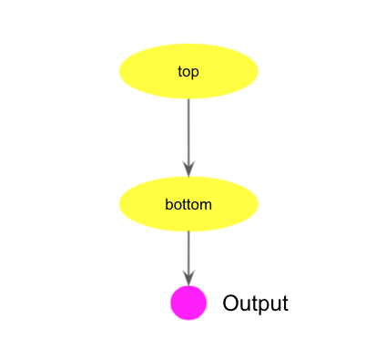
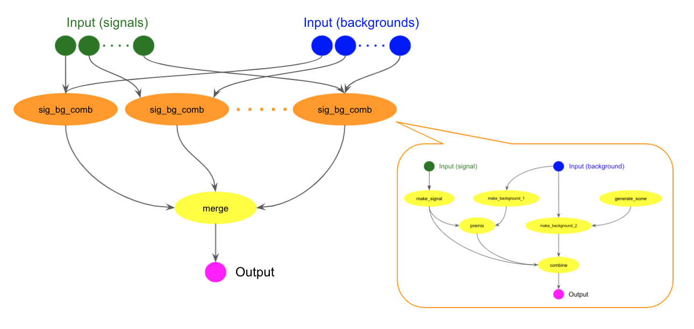

=========================
Running workflow
=========================

A workflow is a set of tasks whose relationship is described with a directed acyclic graph (DAG).
In a DAG, a parent task can be connected to one or more child tasks with each edge directed from
the parent task to a child task. A child task processes the output data of the parent task.
It is possible to configure each child task to get started when the parent task produces the entire output data
or partially produces the output data, depending on the use-case.
If a child task is configured as the latter both parent and child tasks
will run in parallel for a while, which will reduce the total execution time of the workflow.
Currently tasks have to be PanDA tasks, but future versions will support more backend systems such as local
batch systems, production system, kubernetes-based resources,
and other workflow management systems, to run some tasks very quickly or outsource sub-workflows.

The user describes a workflow using the Common Workflow Language (`CWL <https://www.commonwl.org/user_guide/>`_)
and submits it to PanDA using ``pflow``.
This page explains how to use ``pflow`` as well as how to describe workflows.

|br|

.. contents:: Table of Contents
    :local:

-----------

|br|

Workflow examples
^^^^^^^^^^^^^^^^^^^^^^

Simple task chain
======================

The following cwl code shows a parent-child chain of two prun tasks.

.. literalinclude:: cwl/test.cwl
    :language: yaml
    :caption: simple_chain.cwl

The ``class`` field must be :brown:`Workflow` to indicate this code describes a workflow.
There are two prun tasks in the workflow and defined as :blue:`top` and :blue:`bottom` steps in ``steps`` section.
The ``inputs`` section is empty since the workflow doesn't take any input data.
The ``outputs`` section describes the output parameter of the workflow, and it takes only one string type parameter
with an arbitrary name.
The ``outputSource`` connects the output parameter of the *bottom* step to the workflow output parameter.

In the ``steps`` section, each step represents a task with an arbitrary task name, such as :blue:`top`
and :blue:`bottom`.
The ``run`` filed of a prun task is :brown:`prun.cwl`. The ``in`` section specifies a set of parameters
correspond to command-line options of prun.

Here is a list of parameters in the ``in`` section to run a prun task.

.. list-table::
   :header-rows: 1

   * - Parameter
     - Corresponding prun option
   * - opt_inDS
     - ---inDS (string)
   * - opt_inDsType
     - No correspondence. Type of inDS (string)
   * - opt_secondaryDSs
     - ---secondaryDSs (a list of strings)
   * - opt_secondaryDsTypes
     - No correspondence. Types of secondaryDSs (a string array)
   * - opt_exec
     - ---exec (string)
   * - opt_useAthenaPackages
     - ---useAthenaPackages (bool)
   * - opt_architecture
     - ---architecture (string)
   * - opt_containerImage
     - ---containerImage (string)
   * - opt_args
     - all other prun options except for listed above (string)

All options ``opt_xyz`` except ``opt_args`` and ``opt_xyzDsTypes`` can be mapped to :hblue:`---xyz` of prun.
``opt_args`` specifies all other prun options such as :hblue:`---outputs`, :hblue:`---nFilesPerJob`,
and :hblue:`---nJobs`.
Essentially,

.. code-block:: yaml

    run: prun.cwl
    in:
      opt_exec:
        default: "echo %RNDM:10 > seed.txt"
      opt_args:
        default: "--outputs seed.txt --nJobs 3"

corresponds to

.. code-block:: bash

  prun --exec "echo %RNDM:10 > seed.txt" --outputs seed.txt --nJobs 3

The ``out`` section specifies the task output with an arbitrary string surrendered by brackets.
Note that it is always a single string even if the task produces multiple outputs.
The output of the :blue:`top` task is passed to ``opt_inDS`` of the :blue:`bottom` task.
The :blue:`bottom` task starts processing once the *top* task produces enough output data,
waits if all data currently available has been processed but the :blue:`top` task is still running,
and finishes once all data from the :blue:`top` task is processed.

The user can submit the workflow to PanDA using ``pflow`` that is included in panda-client.
First, create a file called :brown:`simple_chain.cwl` containing the cwl code above.
Next, you need to create an empty yaml file since cwl files work with yaml files that describe workflow inputs.
This example doesn't take an input, so the yaml file can be empty.

.. prompt:: bash

  touch dummy.yaml
  pflow --cwl simple_chain.cwl --yaml dummy.yaml --outDS user.<your_nickname>.blah

``pflow`` automatically sends local *.cwl, *.yaml, and *.json files to PanDA together with the workflow.
``--outDS`` is the basename of the datasets for output and log files. Once the workflow is submitted,
the cwl and yaml files are parsed on the server side to generate tasks
with sequential numbers in the workflow. The system uses a combination of the sequential number
and the task name, such as :brown:`000_top` and :brown:`001_bottom`, as a unique identifier for each task.
The actual output dataset name is a combination of ``--outDS``, the unique identifier, and :hblue:`---outputs`
in ``opt_args``. For example, the output dataset name of the :blue:`top` task is
:brown:`user.<your_nickname>.blah_000_top_seed.txt`
and that of the :blue:`bottom` is :brown:`user.<your_nickname>.blah_001_bottom_results.root`.
If :hblue:`---outputs` is a comma-separate
output list, one dataset is created for each output type.

To see all options of ``pflow``

.. prompt:: bash

  pflow --helpGroup ALL

|br|

More complicated chain
========================

The following cwl example describes more complicated chain as shown in the picture below.

.. figure:: images/pflow_dag_combine.png

.. literalinclude:: cwl/sig_bg_comb.cwl
    :language: yaml
    :caption: sig_bg_comb.cwl

The workflow takes two inputs, :blue:`signal` and :blue:`background`. The :blue:`signal` is used as input for
the :blue:`make_signal`
task, while the :blue:`background` is used as input for the :blue:`make_background_1` and
:blue:`make_background_2` tasks.
The :blue:`make_signal` task runs in the busybox container as specified in ``opt_containerImage``, to produce two
types of output data, abc.dat and def.zip, as specified in ``opt_args``.
If the parent task produces multiple types of output data and the child task uses some of them,
their types need to be specified in ``opt_inDsType``.
The :blue:`premix` task takes def.zip from the :blue:`make_signal` task and xyz.pool
from the :blue:`make_background_1` task.

Output data of parent tasks can be passed to a child task as secondary inputs. In this case, they are
specified in ``opt_secondaryDSs`` and their types are specified in ``opt_secondaryDsTypes``.
Note that the stream name, the number of files per job, etc, for each secondary input are specified
using :hblue:`---secondaryDSs` in ``opt_args`` where :hblue:`%%DSn%%` can
be used as a placeholder for the n-th secondary dataset name.
``MultipleInputFeatureRequirement`` is required if ``opt_secondaryDsTypes`` take multiple input data.

The workflow inputs are described in a yaml file. E.g.,

.. prompt:: bash $ auto

  $ cat inputs.yaml

  signal: mc16_valid:mc16_valid.900248.PG_singlepion_flatPt2to50.simul.HITS.e8312_s3238_tid26378578_00
  background: mc16_5TeV.361238.Pythia8EvtGen_A3NNPDF23LO_minbias_inelastic_low.merge.HITS.e6446_s3238_s3250/

Then submit the workflow.

.. prompt:: bash

  pflow --cwl sig_bg_comb.cwl --yaml inputs.yaml --outDS user.<your_nickname>.blah

If you need to run the workflow with different input data it enough to submit it with a different yaml file.

|br|

Nested workflow and parallel execution with scatter
======================================================

It is possible to use a workflow as a step in another workflow.
The following cwl example uses the above :brown:`sig_bg_comb.cwl` in the :blue:`many_sig_bg_comb` step.

.. literalinclude:: cwl/merge_many.cwl
    :language: yaml
    :caption: merge_many.cwl

Note that nested workflows requires ``SubworkflowFeatureRequirement``.

It is possible to run a task or nested workflow multiple times over a list of inputs using
``ScatterFeatureRequirement``.
A popular use-case is to perform the same analysis step on different samples in a single workflow.
The step takes the input(s) as an array and will run on each element of the array as if it were a single input.
The :blue:`many_sig_bg_comb` step above takes two string arrays, :blue:`signals` and :blue:`backgrounds`,
and specifies in the ``scatter`` field that it loops over those arrays.
Output data from all :blue:`many_sig_bg_comb` tasks are fed into the :blue:`merge` task to produce the final output.

The workflow inputs are string arrays like

.. prompt:: bash $ auto

  $ cat inputs2.yaml

  signals:
    - mc16_valid:mc16_valid.900248.PG_singlepion_flatPt2to50.simul.HITS.e8312_s3238_tid26378578_00
    - valid1.427080.Pythia8EvtGen_A14NNPDF23LO_flatpT_Zprime.simul.HITS.e5362_s3718_tid26356243_00

  background:
    - mc16_5TeV.361238.Pythia8EvtGen_A3NNPDF23LO_minbias_inelastic_low.merge.HITS.e6446_s3238_s3250/
    - mc16_5TeV:mc16_5TeV.361239.Pythia8EvtGen_A3NNPDF23LO_minbias_inelastic_high.merge.HITS.e6446_s3238_s3250/

Then submit the workflow.

.. prompt:: bash

  pflow --cwl merge_many.cwl --yaml inputs2.yaml --outDS user.<your_nickname>.blah

|br|

Using Athena
======================

One or more tasks in a single workflow can use Athena as shown in the example below.

.. literalinclude:: cwl/athena.cwl
    :language: yaml
    :caption: athena.cwl

``opt_useAthenaPackages`` corresponds to ``--useAthenaPackages`` of prun to remotely setup Athena with your
locally-built packages.
You can use a different Athena version by specifying :hblue:`---athenaTag` in ``opt_args``.

To submit the task, first you need to setup Athena on local computer, and execute ``pflow``
with ``--useAthenaPackages`` that automatically collect various Athena-related information
from environment variables and uploads a sandbox file from your locally-built packages.

.. prompt:: bash

  pflow --cwl athena.cwl --yaml inputs.yaml --outDS user.<your_nickname>.blah --useAthenaPackages

|br|

Conditional workflow
========================

Workflows can contain conditional steps executed based on their input. This allows workflows
to wait execution of subsequent tasks until previous tasks are done, and
to skip subsequent tasks based on results of previous tasks.
The following example contains conditional branching based on the result of the first step.
Note that this workflows conditional branching require ``InlineJavascriptRequirement`` and CWL version 1.2 or higher.

.. figure:: images/pflow_dag_cond.png

.. literalinclude:: cwl/cond.cwl
    :language: yaml
    :caption: cond.cwl

Both :blue:`bottom_OK` and :blue:`bottom_NG` steps take output data of the :blue:`top` step as input.
The new property ``when`` specifies the condition validation expression that is interpreted by JavaScript.
:hblue:`self.blah` in the expression represents the input parameter :brown:`blah` of the step that is connected
to output data of the parent step. If the parent step is successful :hblue:`self.blah` gives :brown:`True`
while :hblue:`!self.blah` gives :brown:``. It is possible to create more complicated expressions using
logical operators (:brown:`&&` for AND and :brown:`||` for OR) and parentheses. The step is executed when the
whole expression gives :brown:`True`.

The :blue:`bottom_NG` step is executed when the :blue:`top` step fails and :hblue:`$(!self.opt_inDS)` gives
:brown:`True`. Note that in this case output data from the :blue:`top` step is empty and
the prun task in the :blue:`bottom_NG` step is executed without ``--inDS``.

|br|

Involving hyperparameter optimization
==================================================

It is possible to run Hyperparameter Optimization (HPO) and chain it with other tasks in the workflow.
The following example shows a chain of HPO and prun tasks.

.. literalinclude:: cwl/hpo.cwl
    :language: yaml
    :caption: hpo.cwl

where the output data of the :blue:`pre_proc` step is used as the training data for the :blue:`main_hpo` step,
and the output data :brown:`metrics.tgz` of the :blue:`main_hpo` step is used as the input for the
:blue:`post_proc` step.
Both :blue:`main_hpo` and :blue:`post_proc` steps specify ``when`` since they waits until the upstream step is done.

The ``run`` filed of a phpo task is :brown:`phpo.cwl`.
Here is a list of parameters in the ``in`` section to run a prun task.

.. list-table::
   :header-rows: 1

   * - Parameter
     - Corresponding phpo option
   * - opt_trainingDS
     - ---trainingDS (string)
   * - opt_trainingDsType
     - No correspondence. Type of trainingDS (string)
   * - opt_args
     - all other phpo options except for listed above (string)

``opt_trainingDS`` can be omitted if the HPO task doesn't take a training dataset.
Note that you can put most phpo options in a json and specify the json filename in :hblue:`---loadJson`
in ``opt_args``, rather than constructing a complicated string in ``opt_args``.

.. prompt:: bash $ auto

  $ cat config.json
  {
    "evaluationContainer": "docker://gitlab-registry.cern.ch/zhangruihpc/evaluationcontainer:mlflow",
    "evaluationExec": "bash ./exec_in_container.sh",
    "evaluationMetrics": "metrics.tgz",
    "steeringExec": "run --rm -v \"$(pwd)\":/HPOiDDS gitlab-registry.cern.ch/zhangruihpc/steeringcontainer:0.0.1 /bin/bash -c \"hpogrid generate --n_point=%NUM_POINTS --max_point=%MAX_POINTS --infile=/HPOiDDS/%IN  --outfile=/HPOiDDS/%OUT -l nevergrad\""
  }

  $ pflow -cwl hpo.cwl --yaml dummy.yaml --outDS user.<your_nickname>.blah

|br|

How to check workflow description locally
^^^^^^^^^^^^^^^^^^^^^^^^^^^^^^^^^^^^^^^^^^^^^^^^^^^

Workflow descriptions can be error-prone. It is better to check workflow descriptions before submitting them.

-----------------

|br|

Monitoring workflows
^^^^^^^^^^^^^^^^^^^^^^^

|br|
