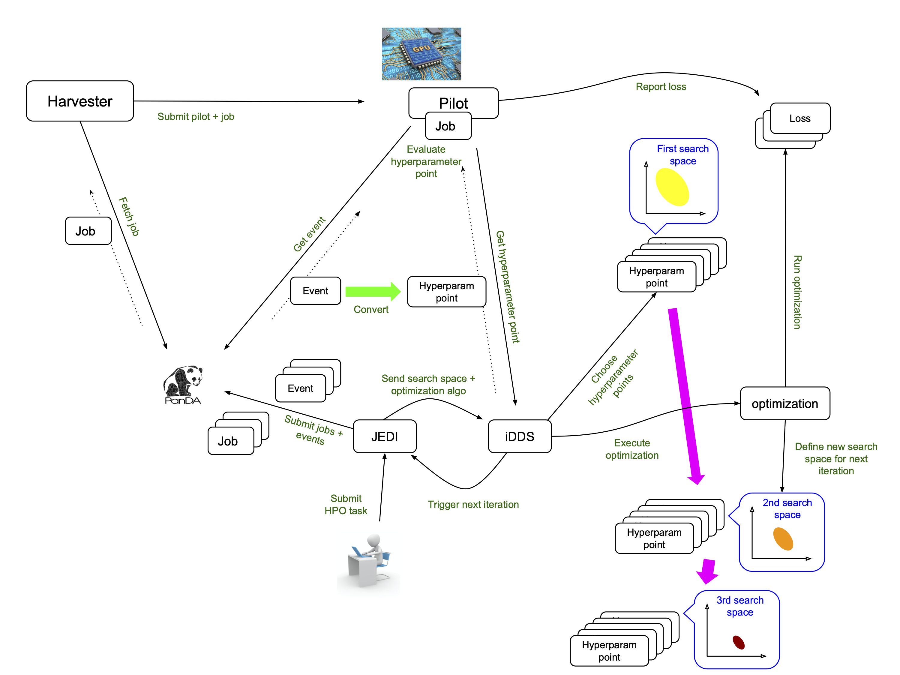
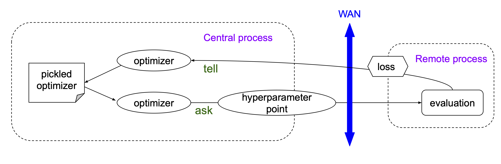
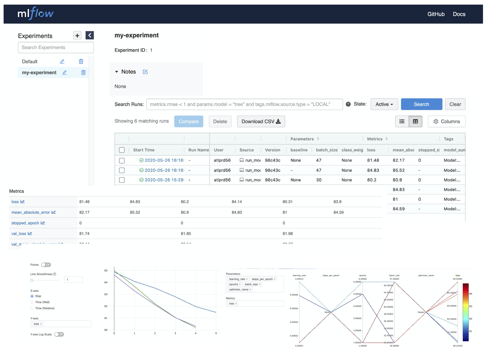
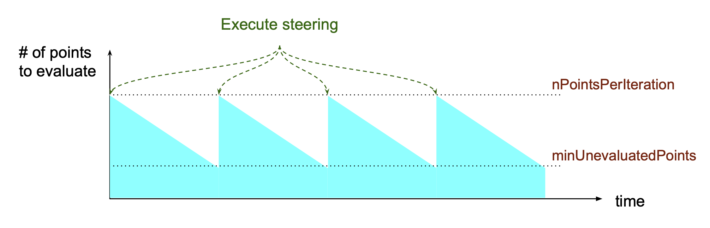
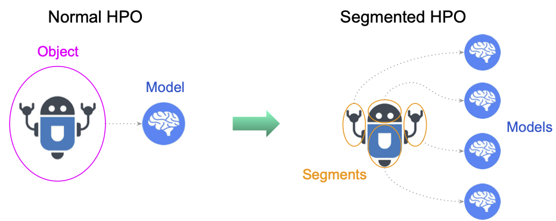
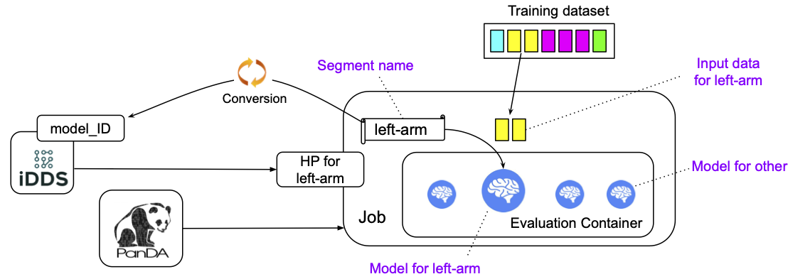

==========================================
Running hyperparameter optimization
==========================================

.. contents:: Table of Contents
    :local:

------------

|br|

Introduction
----------------
PanDA and `iDDS <https://idds.cern.ch/>`_ integrate geographically distributed GPU/CPU resources, so that
users can run special analysis to automatically optimize hyperparameters of machine learning models.

Each HPO workflow is typically composed of iterations of three steps:

* Sampling step
   To choose hyperparameter points in a search space.

* Training step
   To evaluate each hyperparameter point with an objective function and a training dataset.

* Optimization step
   To redefine the search space based on loss values of evaluated hyperparameter points.

In the system, the sampling and optimization steps are executed on central resources while the training step is
executed on distributed resources. The former is called **steering** and the latter is called **evaluation**,
i.e., steering = sampling + optimization, and evaluation = training. Users can submit HPO tasks to PanDA using
``phpo``, which is available in panda-client-1.4.24 or higher.

Once tasks are injected into the system,
iDDS orchestrates JEDI, PanDA, Harvester, and the pilot to timely execute HPO steps on relevant resources,
as shown in the figure above. Users can see what's going on in the system using PanDA monitoring.
The `iDDS document <https://idds.readthedocs.io/en/latest/usecases/hyperparemeter_optimization.html#idds-hpo-workflow>`_
explains how the system works, but end-users don't have to know all the details.
However, one important thing is that a single PanDA job evaluates one or more hyperparameter points and
thus it is good to have a look at log files in PanDA monitoring if there is something wrong.

------------

|br|

Preparation
-------------
The main trick to run hyperparameter optimization (HPO) on distributed resources is the separation of steering and
evaluation and their asynchronous
execution, as shown in the figure below.

Users require two types of containers, one for steering and the other for evaluation.

For steering, users can use predefined containers or their own containers.
Note that users need to use ML packages such as `skopt <https://scikit-optimize.github.io>`_
and `nevergrad <https://github.com/facebookresearch/nevergrad>`_ which support the ask-and-tell pattern,
when making own steering containers.
`This page <https://idds.readthedocs.io/en/latest/usecases/hyperparemeter_optimization.html>`_ explains how
steering containers communicate with the system.
Users provide execution strings to specify how to generate new hyperparameter points in their steering containers.
Each execution string would contain several placeholders which are dynamically
replaced with actual values when the containers are executed.
Input and output are done through json files in the initial working directly ``$PWD`` so that the directory
needs to be initially mounted.

For evaluation, users also provide execution strings to specify what is executed in their containers
to train the ML model. There are two files for input (one for a hyperparameter point to be evaluated and
the other for training data) and three files for output (the first one to report the loss, the second one
to report job metadata, and the last one to preserve training metrics). The input file for a hyperparameter
point and the output file to report the loss are mandatory, while other files are optional.
See the `this page <https://idds.readthedocs.io/en/latest/usecases/hyperparemeter_optimization.html>`_ for the details
of their format.
Note that evaluation containers are executed in the read-only mode, so that file-writing operations have to be done in
the initial working directory ``/srv/workDir``
which is bound to the host working directory where containers and the system communicate using the input and output files.
It is better to dynamically get the path of the initial working directory using ``os.getcwd()``, ``echo $PWD``,
and so on, when applications are executed in evaluation containers,
rather than hard-coding ``/srv/workDir`` in the
applications, since the convention might be changed in the future.

------------

|br|

phpo
----------
``phpo`` is a command-line tool specialized for HPO task submission.
The following options are available in addition to usual options such as ``--site`` and ``--verbose``.
All options can be loaded from a json using ``--loadJson`` if preferable.

.. code-block:: text

  --nParallelEvaluation NPARALLELEVALUATION
                        The number of hyperparameter points being evaluated
                        concurrently. 1 by default
  --maxPoints MAXPOINTS
                        The max number of hyperparameter points to be
                        evaluated in the entire search. 10 by default.
  --maxEvaluationJobs MAXEVALUATIONJOBS
                        The max number of evaluation jobs in the entire
                        search. 2*maxPoints by default. The task is terminated
                        when all hyperparameter points are evaluated or the
                        number of evaluation jobs reaches MAXEVALUATIONJOBS

For steering,

.. code-block:: text

  --nPointsPerIteration NPOINTSPERITERATION
                        The max number of hyperparameter points generated in
                        each iteration. 2 by default Simply speaking, the
                        steering container is executed
                        maxPoints/nPointsPerIteration times when
                        minUnevaluatedPoints is 0. The number of new points is
                        nPointsPerIteration-minUnevaluatedPoints
  --minUnevaluatedPoints MINUNEVALUATEDPOINTS
                        The next iteration is triggered to generate new
                        hyperparameter points when the number of unevaluated
                        hyperparameter points goes below minUnevaluatedPoints.
                        0 by default
  --steeringContainer STEERINGCONTAINER
                        The container image for steering run by docker
  --steeringExec STEERINGEXEC
                        Execution string for steering. If --steeringContainer
                        is specified, the string is executed inside of the
                        container. Otherwise, the string is used as command-
                        line arguments for the docker command
  --searchSpaceFile SEARCHSPACEFILE
                        External json filename to define the search space.
                        None by default

For evaluation,

.. code-block:: text

  --evaluationContainer EVALUATIONCONTAINER
                        The container image for evaluation
  --evaluationExec EVALUATIONEXEC
                        Execution string to run evaluation in singularity.
  --evaluationInput EVALUATIONINPUT
                        Input filename for evaluation where a json-formatted
                        hyperparameter point is placed. input.json by default
  --evaluationTrainingData EVALUATIONTRAININGDATA
                        Input filename for evaluation where a json-formatted
                        list of training data filenames is placed.
                        input_ds.json by default. Can be omitted if the
                        payload directly fetches the training data using wget
                        or something
  --evaluationOutput EVALUATIONOUTPUT
                        Output filename of evaluation. output.json by default
  --evaluationMeta EVALUATIONMETA
                        The name of metadata file produced by evaluation
  --evaluationMetrics EVALUATIONMETRICS
                        The name of metrics file produced by evaluation
  --trainingDS TRAININGDS
                        Name of training dataset

  --checkPointToSave CHECKPOINTTOSAVE
                        A comma-separated list of files and/or directories to
                        be periodically saved to a tarball for checkpointing.
                        Note that those files and directories must be placed
                        in the working directory. None by default
  --checkPointToLoad CHECKPOINTTOLOAD
                        The name of the saved tarball for checkpointing. The
                        tarball is given to the evaluation container when the
                        training is resumed, if this option is specified.
                        Otherwise, the tarball is automatically extracted in
                        the working directories
  --checkPointInterval CHECKPOINTINTERVAL
                        Frequency to check files for checkpointing in minute.
                        5 by default

To see latest or full list of options,

.. prompt:: bash

    phpo --helpGroup ALL

------------

|br|

How to submit HPO tasks
------------------------

There are a couple of concrete examples in `this HPO page <https://gitlab.cern.ch/zhangruihpc/EvaluationContainer>`_.

The most important options of ``phpo`` are ``--steeringContainer``, ``--steeringExec``, ``--evaluationContainer``,
and ``--evaluationExec``,
i.e., container names for steering and evaluation, and what is executed in each container.
Here is an example to show how those options look like.

.. code-block:: bash

 $ cat config_dev.json

 {
    "evaluationContainer": "docker://gitlab-registry.cern.ch/zhangruihpc/evaluationcontainer:mlflow",
    "evaluationExec": "bash ./exec_in_container.sh",
    "evaluationMetrics": "metrics.tgz",
    "searchSpaceFile": "search_space_example2.json",
    "steeringExec": "/bin/bash -c \"hpogrid generate --n_point=%NUM_POINTS --max_point=%MAX_POINTS --infile=$PWD/%IN  --outfile=$PWD/%OUT -l=nevergrad\"",
    "steeringContainer": "gitlab-registry.cern.ch/zhangruihpc/steeringcontainer:latest",
    "trainingDS": "user.hoge.my_training_dataset",
 }

Note that the execution string for the evaluation container is written in a local file ``exec_in_container.sh``.
All files with \*.json, \*.sh, \*.py, \*.yaml in the local current directory are automatically sent to the remote working directory.
So users don't have to specify a complicated execution string in ``--evaluationExec``. E.g.

.. code-block:: bash

 $ cat exec_in_container.sh

 export CURRENT_DIR=$PWD
 export CALO_DNN_DIR=/ATLASMLHPO/payload/CaloImageDNN
 export PYTHONPATH=$PYTHONPATH:$CALO_DNN_DIR/deepcalo
 curl -sSL https://cernbox.cern.ch/index.php/s/HfHYEsmJNWiefu3/download | tar -xzvf -;
 python $CALO_DNN_DIR/scripts/make_input.py input.json input_new.json
 cp -r $CALO_DNN_DIR/exp_scalars $CURRENT_DIR/
 python /ATLASMLHPO/payload/CaloImageDNN/run_model.py -i input_new.json --exp_dir $CURRENT_DIR/exp_scalars/ --data_path $CURRENT_DIR/dataset/event100.h5 --rm_bad_reco True --zee_only True -g 0
 rm -fr $CURRENT_DIR/exp_scalars/
 tar cvfz $CURRENT_DIR/metrics.tgz mlruns/*
 rm -fr mlruns dataset
 ls $CURRENT_DIR/

The initial search space can be described in a json file.

.. code-block:: bash

  $ cat search_space_example2.json

  {
    "auto_lr": {
      "method": "categorical",
      "dimension": {
        "categories": [
            true,
            false
        ],
        "grid_search": 0
      }
    },
    "batch_size": {
      "method": "uniformint",
      "dimension": {
        "low": 10,
        "high": 30
      }
    },
    "epoch": {
      "method": "uniformint",
      "dimension": {
        "low": 5,
        "high": 10
      }
    },
    "cnn_block_depths_1": {
      "method": "categorical",
      "dimension": {
          "categories": [1, 1, 2],
          "grid_search": 0
      }
    },
    "cnn_block_depths_2": {
      "method": "uniformint",
      "dimension": {
        "low": 1,
        "high": 3
      }
    }
  }

Then

.. prompt:: bash

 phpo --loadJson config_dev.json --site XYZ --outDS user.blah.`uuidgen`

Once tasks are submitted, users can see what's going on in the system by using PanDA monitor.

If ``--trainingDS`` is specified each PanDA job gets all files in the dataset unless the task is segmented.
Segmented HPO is explained later.

-----------

|br|

FAQ
-------

Protection against bad hyperparameter points
^^^^^^^^^^^^^^^^^^^^^^^^^^^^^^^^^^^^^^^^^^^^^

Each hyperparameter point is evaluated 3 times at most. If all attempts are timed-out, the system considers
that the hyperparameter
point is hopeless and a very large loss is registered, so that the task continues.

|br|

Visualization of the search results
^^^^^^^^^^^^^^^^^^^^^^^^^^^^^^^^^^^^^^

It is possible to upload a tarball of metrics files to a grid storage when evaluating each hyperparameter point.
For example, the above example
uses `MLflow <https://mlflow.org/>`_ for logging parameters and metrics, collects all files under ./mlflow
into tarballs, and uploads them to grid storages.
The filename of the tarball needs to be specified using the ``--evaluationMetrics`` option. Tarballs are
registered in the output dataset so that they can
be download using rucio client. It is easy to combine MLflow metrics files. The procedure is as follows:

.. prompt:: bash

 rucio download --no-subdir <output dataset>
 tar xvfz *
 tar xvfz metrics*
 mlflow ui

Then access to http://127.0.0.1:5000 using your own browser will show something like the figure below.

There is an on-going development activity to dynamically spin-up MLFlow services on !PanDA monitoring or something
which would do the above procedure on behalf of users and centrally provide MLFlow UI to users.

|br|

Relationship between nPointsPerIteration and minUnevaluatedPoints
^^^^^^^^^^^^^^^^^^^^^^^^^^^^^^^^^^^^^^^^^^^^^^^^^^^^^^^^^^^^^^^^^^^

The relationship between ``nPointsPerIteration`` and ``minUnevaluatedPoints`` is illustrated in the above figure.
The steering is executed to generate new hyperparameter points every time the number of unevaluated points goes below
``minUnevaluatedPoints``.
The number of new points is ``nPointsPerIteration-minUnevaluatedPoints``. The main idea to set a non-zero value to
``minUnevaluatedPoints`` is to keep
the task running even if some hyperparameter points take very long to be evaluated.

|br|

What "Logged status: skipped since no HP point to evaluate or enough concurrent HPO jobs" means in PanDA monitor
^^^^^^^^^^^^^^^^^^^^^^^^^^^^^^^^^^^^^^^^^^^^^^^^^^^^^^^^^^^^^^^^^^^^^^^^^^^^^^^^^^^^^^^^^^^^^^^^^^^^^^^^^^^^^^^^^

PanDA jobs are generated every 10 min, when the number of active PanDA jobs is less than ``nParallelEvaluation`` and
there is at least one unevaluated hyperparameter point.
The logging message means that there are enough PanDA jobs running/queued in the system, or the system has evaluated
or is evaluating all hyperparameter points which have been generated so far. Note that there is a delay for iDDS to
trigger the next iteration after enough hyperparameter points were evaluated in the previous iteration.

|br|

Checkpointing
^^^^^^^^^^^^^^^^^^

If evaluation containers support checkpointing it is possible to terminate evaluation in the middle and resume
it afterward, which is typically
useful to run long training on short-lived and/or preemptive resources. Evaluation containers need to

* periodically produce checkpoint file(s) in the initial working directory or in sub-directories under
  the initial working directory by using relevant functions of ML packages like
  `keras example <https://keras.io/getting_started/faq/#how-can-i-regularly-save-keras-models-during-training>`_,
  and

* resume the training if checkpoint file(s) are available in the initial working directory, otherwise,
  start a fresh training.

Users can specify the names of the checkpoint files and/or the sub-directories using the ``--checkPointToSave`` option.
The system periodically checks the files and/or sub-directories, and saves them in a persistent location if some of
them were updated after the previous check cycle. The check interval
is defined by using ``--checkPointInterval`` which is 5 minutes by default. Note that the total size of checkpoint
files must be less than 100 MB.
When PaDA jobs are terminated while evaluating hyperparameter points, they are automatically retried. The latest
saved checkpoint files
are provided to the retried PanDA jobs. If the ``--checkPointToLoad`` option is specified the checkpoint
files/directories are archived to a tarball which
is placed in the initial working directory, otherwise, they are copied to the initial working directory with
the original file/directory names.

|br|

Segmented HPO
^^^^^^^^^^^^^^

It is possible to define multiple ML models in a single HPO task and optimize hyperparameters for each
model independently. This is typically useful when you have a target object, which can be logically
or practically partitioned
to sub-objects, and want to optimize their ML models in one-go.
For example, it would be reasonable to logically break down a puppet to several parts, such as arms, body, and legs,
in some use-cases, but it would be nightmare to submit a HPO task for each part if there are so many.
Instead, the user would submit a single task for the puppet and let the system split workload based on the
user-defined breakdown instruction, which would significantly simplify bookkeeping from user's point of view.
It is enough to prepare a single training dataset which contains files for all models, but the user
needs to specify how the training dataset is partitioned by using the ``--segmentSpecFile`` option.

.. code-block:: text

  --segmentSpecFile SEGMENTSPECFILE
                        External json filename to define segments for
                        segmented HPO which has one model for each segment to
                        be optimized independently. The file contains a list of
                        dictionaries {'name': arbitrary_unique_segment_name,
                        'files': [filename_used_for_the_segment_in_the_training_dataset,
                        ... ]}. None by default

For example, when a dataset contains file_1, file_2, file_3, ..., and file_N, the json would be something like

.. code-block:: bash

    $ cat seg.json
    [
        {
            "files": [
                "file_1",
                "file_3"
            ],
            "name": "name_A"
        },
        {
            "files": [
                "file_2"
            ],
            "name": "name_B"
        }
    ]

so that there are two segments in the task. Then

.. prompt:: bash

 phpo --segmentSpecFile seg.json --trainingDS blah ...

The first segment is called *name_A* and PanDA jobs for the segment
takes only *file_1* and *file_3* from the training dataset, while the second segment is called *name_B* and
PanDA jobs for the segment takes only *file_2*. It is possible to use *%SEGMENT_NAME* in ``--evaluationExec``
which is replaced with the actual segment name, such as *name_A* and *name_B*, so that the evaluation
container can dynamically choose the model relevant to the segment name as shown in the figure below.

The segment name is prepended to
metrics files to show for which segment the metrics file contains information. For example,

.. code-block:: bash

    "evaluationExec": "python toy.py %SEGMENT_NAME",
    "evaluationMetrics": "metrics.tgz",

with those options, PanDA jobs for the first segment would execute the evaluation container with
"python toy.py name_A" so that toy.py would change configuration based on sys.argv[1],
and the system would rename metrics.tgz to name_A.XYZ.metrics.tgz.