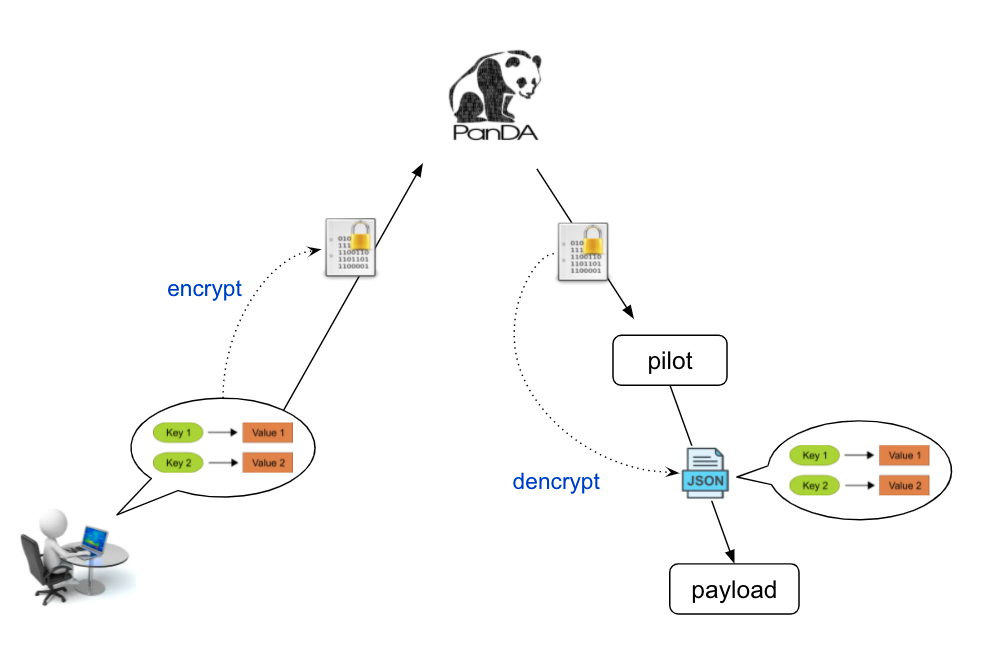

=========================
Using secrets
=========================

Introduction
--------------

A secret is a small amount of sensitive data such as an access token and a password.
PanDA allows users to define arbitrary key-value strings to feed secrets to jobs.
They are encrypted in PanDA and decrypted on the compute node, and jobs
get a json file which contains the original key-value strings.
Note that the key-values are random strings from PanDA’s point of view, and users can further encrypt
those strings by themselves, so the system should not abuse the sensitive information.

How to manage secrets
---------------------------

``pbook`` provides following functions to manage secrets.

.. code-block:: bash

    set_secret
    list_secrets
    delete_secret
    delete_all_secrets

You can define a set of key-value strings using :blue:`set_secret`.

.. code-block:: bash

   >>> set_secret('MY_SECRET', 'random_string')
   INFO : OK

The value must be a string. If you want to define non-string data, serialize it using ``json.dumps``, base64,
or something. E.g.,

.. code-block:: bash

   >>> import json
   >>> set_secret('MY_SECRET_SER', json.dumps({'a_key': 'a_value'}))
   INFO : OK

.. code-block:: bash

   >>> import base64
   >>> bin_file = open('some_binary_file', 'rb')
   >>> set_secret('MY_SECRET_BIN', base64.b64encode(bin_file.read()).encode())
   >>> bin_file.close()
   INFO : OK

``list_secrets`` shows all secrets.

.. code-block:: bash

    >>> list_secrets()

        Key           : Value
        ------------- : --------------------
        MY_SECRET     : random_string
        MY_SECRET_SER : {"a_key": "a_value"}
        ...

You can delete secrets using :blue:`delete_secret` and/or :blue:`delete_all_secrets`.

Using secrets in your jobs
---------------------------------

``prun`` has the :blue:`--useSecrets` option to feed secrets into jobs running on computing resources.
Once jobs get started :hblue:`panda_secrets.json` should be available in the current directory.
Your applications would do something like

.. code-block:: python

  import json
  import base64
  with open('panda_secrets.json') as f:
      secrets = json.load(f)
      do_something_with_a_secret(secrets['MY_SECRET'])

      with open('some_binary_file', 'wb') as f:
          f.write(base64.b64decode(secrets['MY_SECRET_BIN']))
      do_someting_with_a_binary_secret('some_binary_file')
