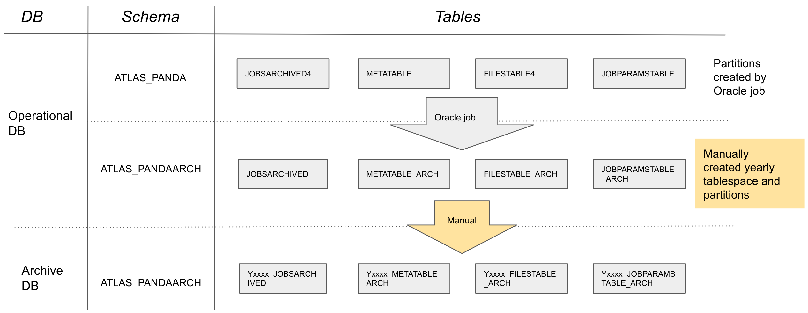

==================
Archival strategy
==================

PanDA itself does not depend on completed jobs to be archived, but it is relevant for monitoring and audits. ATLAS
chooses to keep all of their historical data, but does a yearly archival exercise for some of the tables. ATLAS has two
databases and different schemas to implement a two step archival as shown in the diagram. As mentioned before,
the archive database is never/rarely accessed and does not need to be very performant. Alternative strategies could
be envisioned to avoid having a separate archive database.

