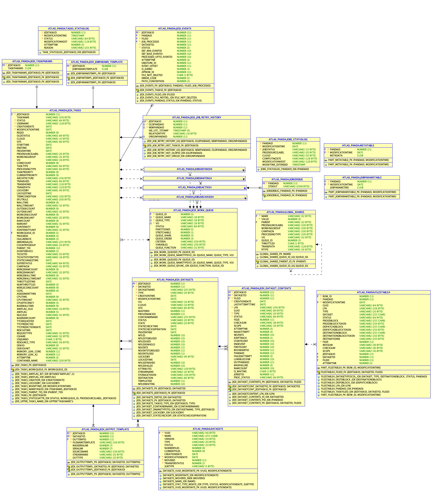
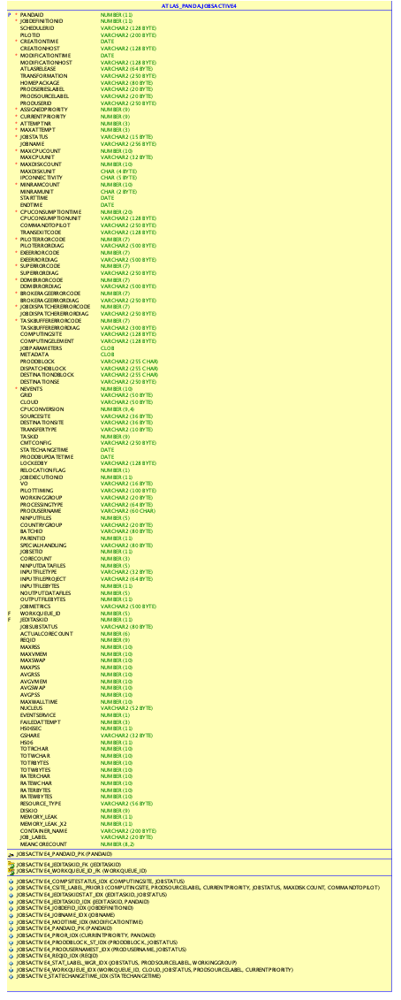
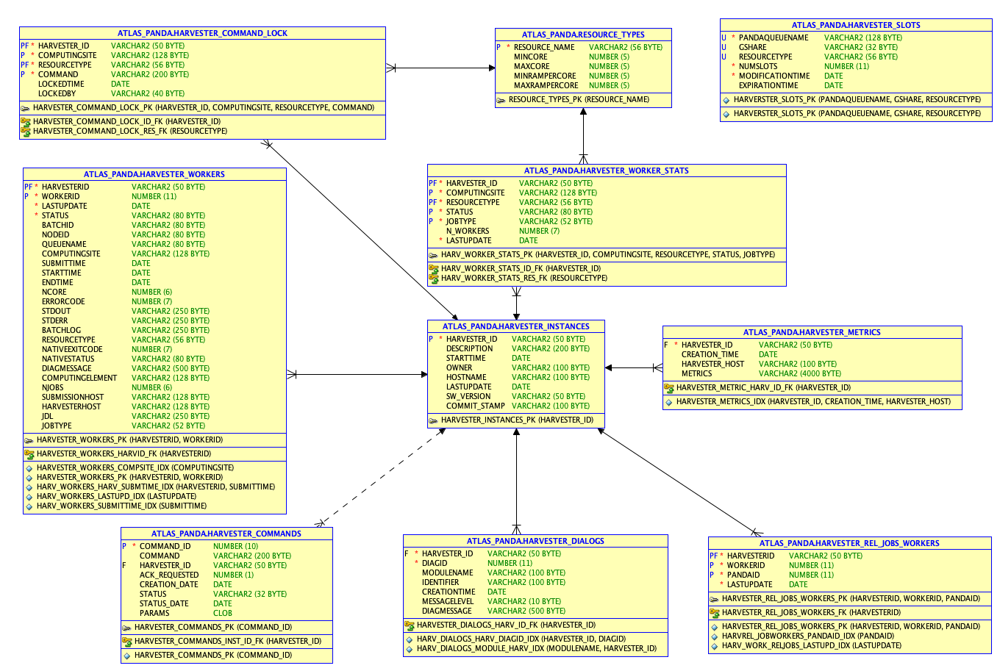
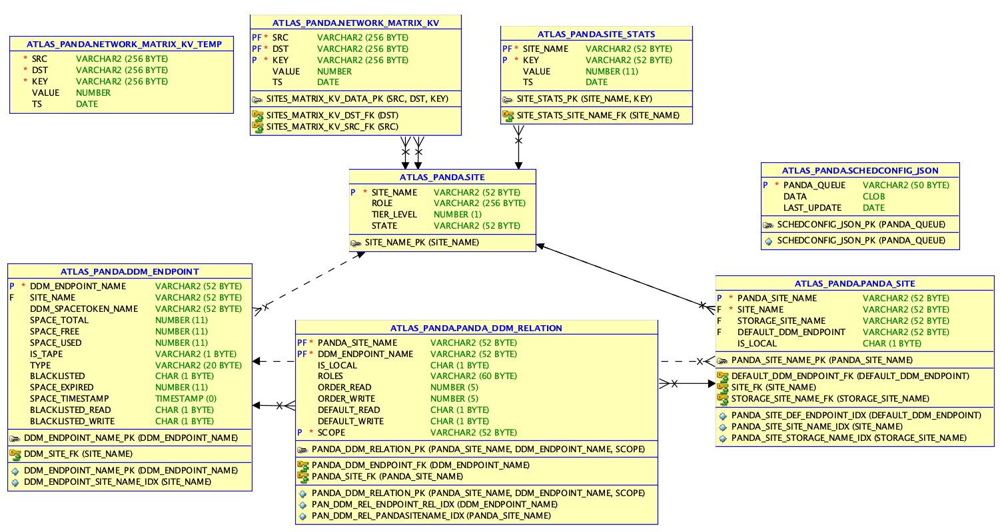
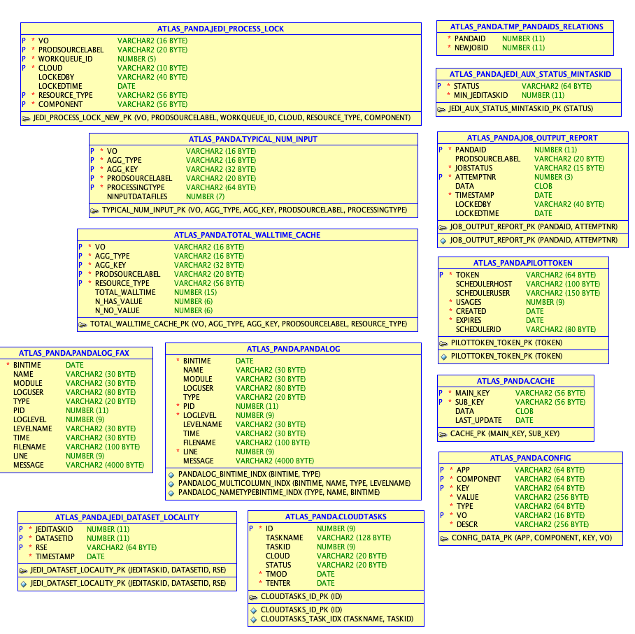

=========================
Entity relation diagrams
=========================

This section will give an overview of the database structure and important table groups.

ATLAS_PANDA schema
============================

Tasks and jobs
________________
A task is a group of jobs. A task is submitted to process a dataset (=group of files) and
is split to generate jobs. New tasks are inserted into the JEDI_TASKS
For historical reasons, jobs are initially inserted into the
Jobs

- Tasks and jobs

ATLAS_PANDAARCH schema
============================

123

ATLAS_PANDAMETA schema
============================

123