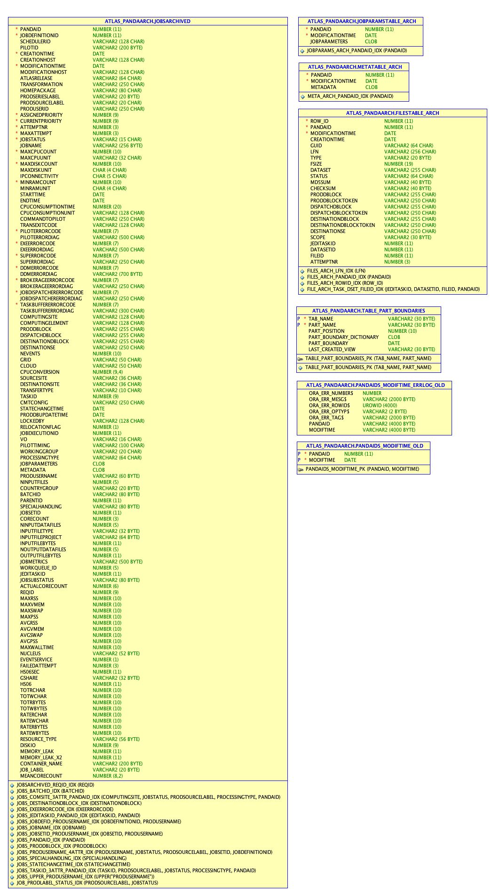
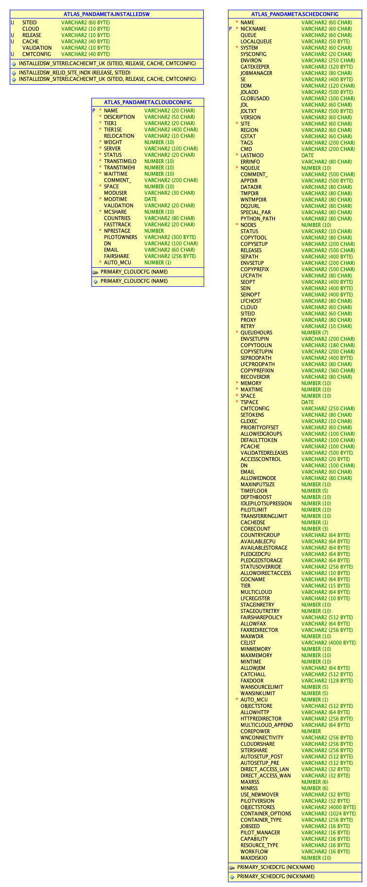

=========================
Entity relation diagrams
=========================

This section will give an overview of the database structure and important table groups.

ATLAS_PANDA schema
============================

Tasks and jobs
________________
A task is a group of jobs. A task is submitted to process a dataset (=group of files) and
is split to generate jobs. New tasks are inserted into the ``JEDI_TASKS`` table. Each task
entry has a unique ``JEDITASKID`` primary key, which is used for referencing.
The input and output dataset and file information is stored into the ``JEDI_DATASETS`` and
``JEDI_DATASET_CONTENTS`` respectively.

Jobs for each task are generated and move (for historical reasons) across the
``JOBSDEFINED4``, ``JOBSWAITING4``, ``JOBSACTIVE4`` and ``JOBSARCHIVED4``
tables as they progress in their state. Note that the details for the jobs tables have been
hidden in the overview diagram for visibility reasons, but the ``JOBSACTIVE4`` table is
displayed separately. The 4 job tables are mostly similar, the only differences should
be in some indexes in ``JOBSACTIVE4`` and ``JOBSARCHIVED4``, since these are the larges
and most commonly queried tables. Each job has a unique ``PANDAID`` primary key, which
is used for referencing.

Jobs have auxiliary metadata and job parameters stored in teh METATABLE and JOBPARAMSTABLE. ]
These entries travel together with the jobs during the archival process.

Each job has associated files in ``FILESTABLE4``. ``FILESTABLE4`` and ``JEDI_DATASET_CONTENTS``
are often misunderstood. The main difference is that ``FILESTABLE4`` has entries for each
job retry and therefore can be queried by ``PANDAID``, while ``JEDI_DATASET_CONTENTS`` contains
the "primary" entries and only the latest retry of the job will be shown in the ``PANDAID``
column.

To track the state transition of tasks and jobs, there are auxiliary tables ``TASKS_STATUSLOG``
and ``JOBS_STATUSLOG``.

Another important concept are work queues ``JEDI_WORK_QUEUE`` and global shares ``GLOBAL_SHARES``.
Global shares is an extension of the work queue. When jobs are created, they are tagged
with a work queue and global share. Work queues are internal, parallel pipes in JEDI
to handle orderly task and job processing. Global shares are nestable targets for the work queues.
In this way we can control the amount of jobs of each type processed and can share common
resources across groups.

.. figure:: images/JEDI.png
   :width: 1000

Configurator
________________

Configurator tables store the site hierarchy and associations between computing and storage endpoints. A site (``SITE``)
can contain multiple storage endpoints ``DDM_ENDPOINT`` and multiple PanDA compute queues ``PANDA_SITE``.
The compute queues must be configured to read from or write to the storage endpoints in the relation table
``PANDA_DDM_RELATION`` in order to use it.

Additional information about a site can be stored in the ``SITE_STATS`` table in Key-Value format.

The connectivity between sites can be stored in the ``NETWORK_MATRIX_KV``. ``NETWORK_MATRIX_KV_TEMP`` is an auxiliary
table used only to optimize the speed of the loading process.

All the PanDA queue configuration is stored in JSON format in the ``SCHEDCONFIG_JSON`` table. This table is an evolution
of the ``ATLAS_PANDAMETA.SCHEDCONFIG`` table, which needs to be updated each time a new attribute is added.

.. figure:: images/Configurator.png
   :width: 1000

Harvester
________________

Harvester is the resource facing tool in the PanDA ecosystem. Each Harvester has its own database
(MySQL/MariaDB or SQLite) and synchronizes its state with PanDA for centralized monitoring.

Harvester instances need to be registered in ``HARVESTER_INSTANCES`` for PanDA to accept the incoming data.

Individual worker information is stored in the ``HARVESTER_WORKERS`` table. This table can/should be
cleaned with a sliding window process. A worker can process multiple PanDA jobs, therefore the relationship
to the jobs is stored in the ``HARVESTER_REL_JOB_WORKERS`` table.

Worker data is aggregated into ``HARVESTER_WORKER_STATS``. These statistics are used by Unified Pilot Streaming (UPS)
service to determine which types of workers need to be submitted next. With this information, UPS generates
commands in ``HARVESTER_COMMANDS``, which are picked up by Harvester through the PanDA API.

Harvester also publishes service information (e.g. instance CPU/memory/disk usage and validity of proxies)
in json format, which is useful for service dashboards and alarms. This information is stored in ``HARVESTER_METRICS``.
Harvester sends error messages from the internal log files to PanDA and are stored in ``HARVESTER_DIALOGS``.

.. figure:: images/Harvester.png
   :width: 1000

Others
________________

PanDA frequently requires to calculate aggregations of the jobs. It is very costly to run independent aggregations
of the tables within seconds. For this reason, in the background there are some Oracle jobs pre-calculating and filling
these tables every couple of minutes. This reduces the CPU load on the DB significantly.

There is also a table ``TABLEPART4COPYING`` used to track the status of the job archival from ``ATLAS_PANDA``
to ``ATLAS_PANDAARCH``.

.. figure:: images/Auxiliary.png
   :width: 1000

Finally there are a variety of other tables to complete the overview of tables.

.. figure:: images/Leftovers.png
   :width: 1000

ATLAS_PANDAARCH schema
============================

The PANDAARCH schema is simple. It contains an archive of old jobs and directly associated entries.
The tables have a slightly different name. They are not accessed by PanDA itself, but are queried
by the monitoring to view older jobs.

There are some auxiliary tables used for the archival process.

ATLAS_PANDAMETA schema
=========================

The PANDAMETA schema was used initially to store Grid and PanDA configuration, but is becoming less relevant over the years.
``SCHEDCONFIG`` stores PanDA queue configuration. We are moving to the ``SCHEDCONFIG_JSON`` table in the main schema. This
table is still used for joined queries, but once we are on a higher Oracle version that allows querying the fielsds in
the JSON documents, we should try to move away completely from ``SCHEDCONFIG``.
``CLOUDCONFIG`` lists the clouds (WLCG regional and political groupings) and the main Tier 1 queue in each cloud.
``INSTALLED_SW`` tracks the software that is installed in each queue.

