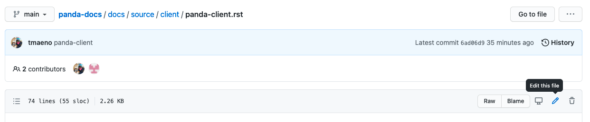
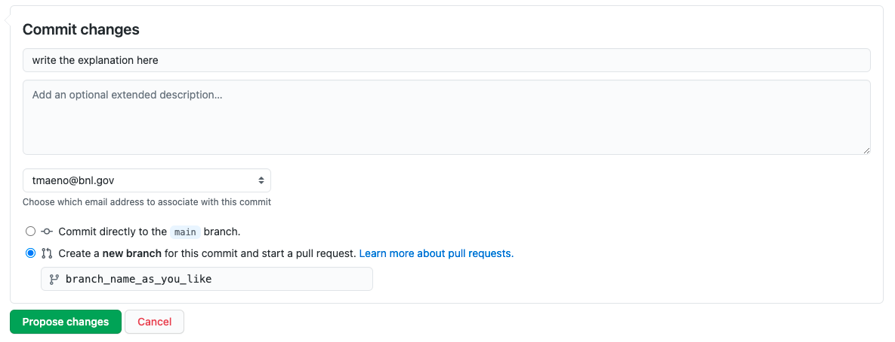

================================
Adding Changes to Documentation
================================

It is enough to submit pull requests directly from GitHub to add minor changes to existing
documentation pages.

1. Go to the corresponding code page
--------------------------------------

First, you need to go to the code page in
`the GitHub repository <https://github.com/PanDAWMS/panda-docs/tree/main/docs/source>`_
corresponding to the documentation you
want to edit. Generally, https://panda-wms.readthedocs.io/en/latest/X/Y.html corresponds to
X/Y.rst in the repository.

2. Edit the code page
-----------------------

You can directly edit the page by clicking the pencil icon as shown below.

Preview the page before submitting a pull request.

3. Submit a pull request
--------------------------

If everything looks good, go to the bottom of the code page and choose a radio button to
create a new branch for this commit, and start a pull request, as shown in the picture below.

You need to write the reason for the changes in the commit title field and use an arbitrary string as the branch name.
Then click the Propose changes button.
Then the request is reviewed, and the changes will be merged to the main branch once approved.

4. Publish the latest documents
----------------------------------

The merge action triggers automatic-builds on the Read The Docs
and the latest documents show up at https://panda-wms.readthedocs.io/en/latest/ .
