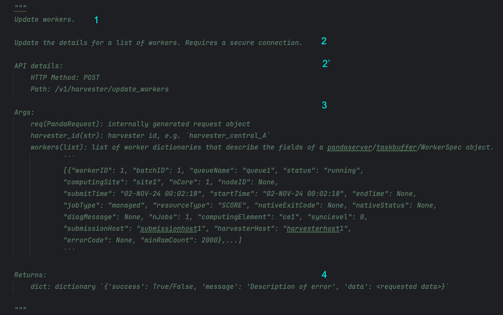
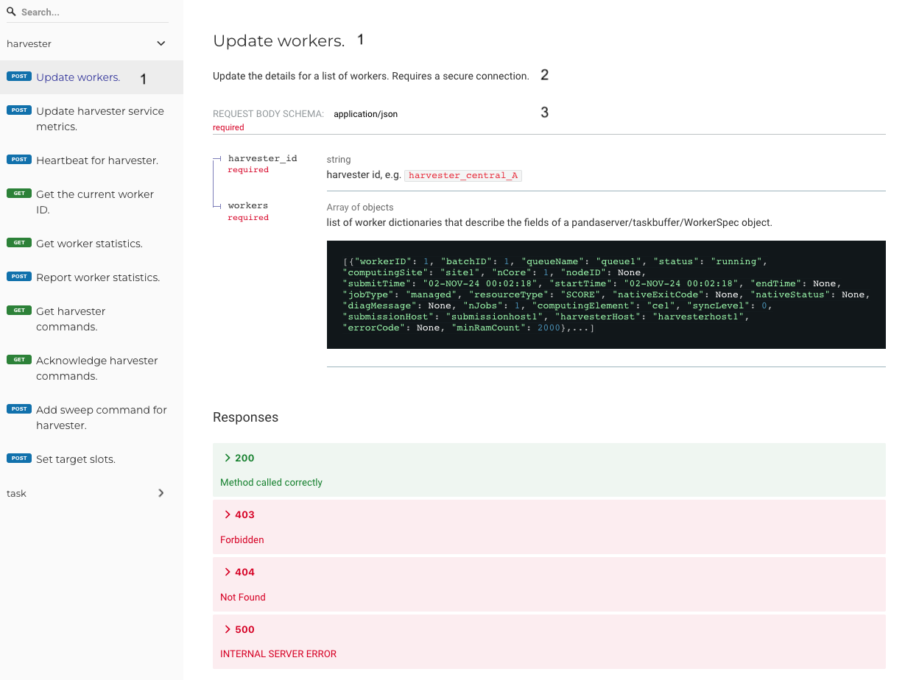

==========================================
Contributing code to PanDA server and JEDI
==========================================

This guide outlines the coding standards and practices for contributing to the PanDA server and JEDI packages.

PEP 8 Naming Conventions
========================

We are trying to steer the project towards the PEP8 Style Guide, in order to improve readability and adopting a common style.
Below is a summary of some key naming conventions:

- **Files**: Use lowercase with underscores (e.g., `my_module.py`).
- **Classes**: Use CapWords convention (e.g., `MyClass`).
- **Functions**: Use lowercase with underscores (e.g., `my_function()`).
- **Variables**: Use lowercase with underscores (e.g., `my_variable`).
- **Constants**: Use all uppercase with underscores (e.g., `MY_CONSTANT`).

We are extending the line limit to 160 characters.

We are moving towards f-strings. They are more readable and easier to maintain than the old style of string formatting.

For more details, refer to the `PEP 8 documentation <https://www.python.org/dev/peps/pep-0008/>`_.

Commenting Guidelines
=====================

Comments are crucial for code maintainability and readability. They should not be used as a substitute for writing clean,
understandable code. Here are some best practices:

- **Docstrings**: Use docstrings for all public modules, functions, classes, and methods.
  Docstrings should follow the `PEP 257 <https://www.python.org/dev/peps/pep-0257/>`_ style guide.
  While the usage is not always consistent, we would like to adhere to the `Google Style <https://sphinxcontrib-napoleon.readthedocs.io/en/latest/example_google.html>`_
  for PanDA server and JEDI. In particular, this style is mandatory to generate the OpenAPI for PanDA server.

- **Inline Comments**: They should be used to explain why a particular piece of code does something, not what it does.
  Place the comment above the code and align it with the code it's commenting on.

- **Block Comments**: These should be used to describe logical sections of a code file.
  They should be placed above the code block they're describing and should be aligned with the code.

Examples of commenting that does not help with the understanding:

.. code-block:: python

    def get_logger():
        my_logger = logging.getLogger("sample-logger")
        # remove existing handlers
        while my_logger.hasHandlers():
            my_logger.removeHandler(my_logger.handlers[0])
        # make new handler
        _log_handler = logging.StreamHandler(sys.stdout)
        _log_formatter = logging.Formatter("%(asctime)s %(name)-12s: %(levelname)-8s %(message)s")
        _log_handler.setFormatter(_log_formatter)
        # add new handler
        my_logger.addHandler(_log_handler)
        # debug log level
        my_logger.setLevel(logging.DEBUG)
        # return logger
        return my_logger

and a suggestion for improved logging:

.. code-block:: python

    def get_logger():
        """
        - Retrieves a logger
        - Cleans up existing handlers to avoid duplicate logs
        - Adds a new handler to print logs to stdout
        - Configures the sample logger to use a specific format
        - Sets the log level to DEBUG
        """
        my_logger = logging.getLogger("sample-logger")

        # remove existing handlers
        while my_logger.hasHandlers():
            my_logger.removeHandler(my_logger.handlers[0])

        # make and configure new handler
        _log_handler = logging.StreamHandler(sys.stdout)
        _log_formatter = logging.Formatter("%(asctime)s %(name)-12s: %(levelname)-8s %(message)s")
        _log_handler.setFormatter(_log_formatter)
        my_logger.addHandler(_log_handler)
        my_logger.setLevel(logging.DEBUG)

        return my_logger

Code quality tools
==================

There are a number of tools that can be used to improve code quality and consistency.

Code formatters:

- **Black**: Black is a Python code formatter that reformats your code to make it more readable. It implements a subset of PEP 8. It has very few configuration options, but it's very opinionated.
- **Autopep8**: Autopep8 is a tool that automatically formats Python code to conform to the PEP 8 style guide. It offers more configuration options, allowing you to choose which rules to apply or ignore.
- **Flynt**: Flynt is a tool that automatically converts old-style Python code to use f-strings. It is very useful for converting code that uses the old style of string formatting to f-strings.

Help with imports:

- **Isort**: Isort is a Python utility that sorts imports alphabetically and automatically separates them into sections.

Code linters:

- **Flake8**: Flake8 is a tool that combines PyFlakes, pycodestyle, and McCabe complexity checker. It checks for style errors and programming errors.
- **Pylint**: Pylint is a tool that checks for errors in Python code, tries to enforce a coding standard, and looks for code smells. Pylint is much more strict than Flake8.

We can use these tools either manually, or as pre-commit hooks. To have a commonly available configuration,
we are adding our configuration options to the ``pyproject.toml`` file. For example:

.. code-block:: yaml

    [tool.black]
    line-length=160

    [tool.autopep8]
    # https://pypi.org/project/autopep8/#pyproject-toml
    max_line_length = 160
    ignore = ["E501", "W6"]
    in-place = true
    recursive = true
    aggressive = 3

    [tool.pylint]
    max-line-length = 160
    [tool.pylint.'MESSAGES CONTROL']
    disable = [
        "C0209",
        "R0902",
        "R0913",
        "R0914", #  R0914: Too many local variables
    ]

    [tool.isort]
    profile = "black"

Pre-commit Hooks
================

We use pre-commit hooks to ensure code quality and consistency.

- **Part of Git**: Pre-commit hooks are a built-in feature of Git. They allow you to execute custom scripts automatically before a commit is finalized.

- **Triggered by YAML**: These hooks are configured in a ``.pre-commit-config.yaml`` file. This YAML file specifies which
  hooks to run and their respective settings.

- **Local Setup**: To use pre-commit hooks, each developer needs to have the ``pre-commit`` package installed on their local development
  machine (see https://pre-commit.com/) and enabled on each PanDA package. Make sure it's installed in the environment where
  you'll be running Git commands. All of the chosen pre-commit hooks (black, autopep8, isort, flake8, pylint...)
  need to be installed as well. Be aware that some of the tools that automatically change your code can be incompatible with each other
  and undo each other's changes.

In our case, since we are adding code quality tools at a very late stage, we are starting with tools that will help us
improve readability. It is not feasible to add flakes and pylint at this stage, as they will generate a lot of errors and hinder
the development process.

A sample ``.pre-commit-config.yaml`` with our current tools of choice is shown below

.. code-block:: yaml

    repos:
    -   repo: https://github.com/ikamensh/flynt
        rev: ''  # Specify a specific version if desired
        hooks:
        -   id: flynt
            args: [ "--line-length", "160"]  # Flynt does not support pyproject.toml in special locations

    -   repo: https://github.com/psf/black
        rev: 23.9.1
        hooks:
        -   id: black
            types: [python]
            args: ["--config", "package/pyproject.toml"]

    -   repo: https://github.com/pycqa/isort
        rev: 5.12.0
        hooks:
        -   id: isort
            name: isort (python)

PanDA server API
================
We are building the PanDA server API using the OpenAPI specification and using ReDoc to generate the it. Frameworks like FastAPI or Flask-RESTful
generate the API from the OpenAPI specification automatically. However we are not using these frameworks and instead need to
generate the OpenAPI yaml specification file from the Google-style docstrings in the code. Please pay attention to how the docstring
fields correspond to the OpenAPI fields.

1. Short summary. This is the first line of the docstring and is used as the summary in the OpenAPI specification. Keep this one short.
2. Long description. Here you can provide a more detailed description of the endpoint. This will be used as the description in the OpenAPI specification.
2'. The "API details" section is not really part of standard docstring formatting, but we use it to provide additional key-value pairs that are parsed manually. We remove this section from the final OpenAPI documentation.
3. The "Args" section will be used to generate the parameters in the OpenAPI specification. For GET requests, these will be query parameters. For POST requests, these will be request body parameters.
4. "Returns" is overwritten by a generic, more detailed "Response" section in the OpenAPI specification. We are returning always a json dictionary with the same format.

You can use code blocks in the docstrings to provide examples of the request and response.

The script to parse the docstring is here: https://github.com/PanDAWMS/panda-docs/blob/main/docs/source/api_specs/. If you run the api_doc.sh script,
it will clone the panda-server repository, parse the docstrings, install redoc-cli, and generate the standalone OpenAPI documentation under the _static folder.
This specification will be uploaded to github and later to readthedocs.

