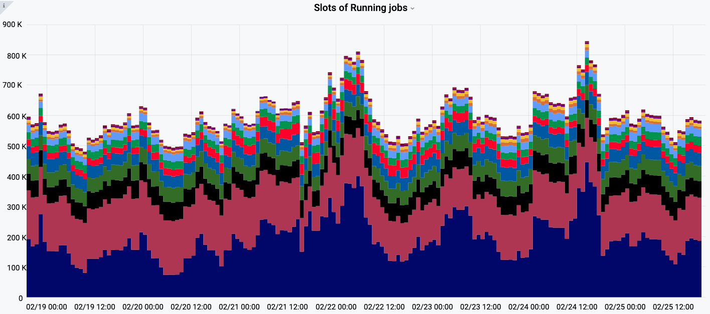

========================
Introduction
========================

The Production and Distributed Analysis (PanDA) system has been developed to meet ATLAS production
and analysis requirements for a data-driven workload management system capable of operating at the LHC
data processing scale. PanDA scalability has been demonstrated in ATLAS through the rapid increase
in usage over the last decade. PanDA was designed to have the flexibility to adapt to emerging computing
technologies in processing, storage, networking, and distributed computing middleware.

.. figure:: /terminology/images/PandaSys.png
  :align: center

  PanDA system overview

|br|

The flexibility has been successfully demonstrated through the past decade of evolving technologies
adopted by computing centers in ATLAS, spanning many continents. PanDA performed very well, including
the LHC data-taking period. The system has been producing high volumes of Monte Carlo samples and making
large-scale diverse computing resources available for individual analysis.
A wide range of compute resources have been seamlessly integrated,
such as WLCG grid, commercial cloud, volunteer computing, and high-performance computing resources.
There are typically 600,000 jobs concurrently running in the system, and more than 5 million jobs are
processed in total per week.

  The number of jobs concurrently running in ATLAS PanDA system

|br|

This proven scalability and flexibility make PanDA well suited for adoption by various exabyte
scale sciences. The interest in PanDA by other big data sciences brought the primary motivation to
generalize PanDA, providing location transparency of processing and data management,
for High Energy Physics community and other data-intensive sciences and a wider exascale community.

|br|