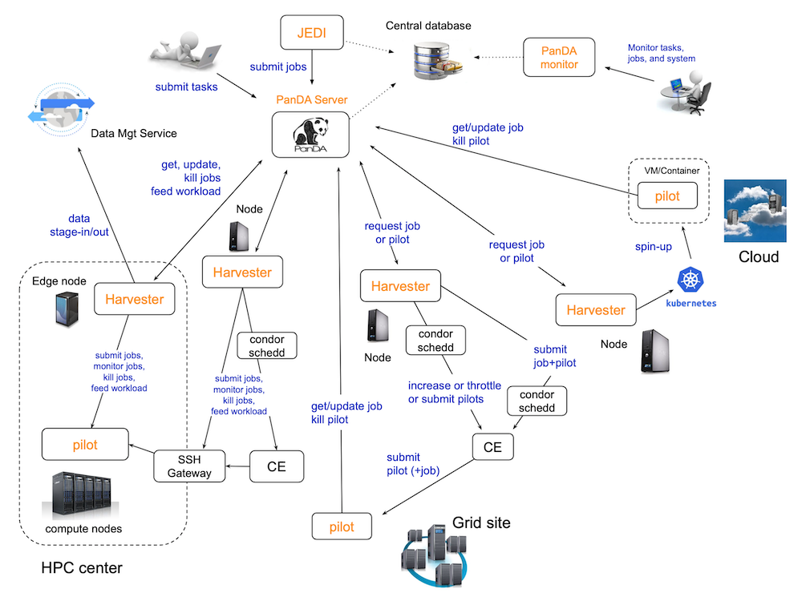
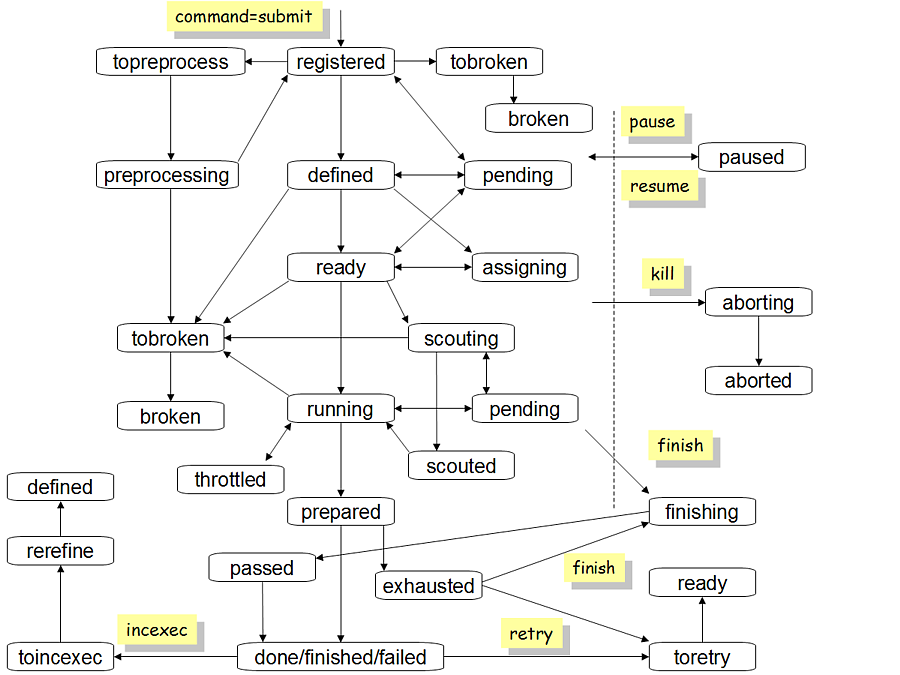

===============
Basic Concepts
===============

.. contents::
    :local:

----------

|br|

Compute and storage resources, and worker node
------------------------------------------------
Compute resource providers, such as the grid, HPC centers, and commercial cloud services, offer compute resources with
processing capabilities. A worker node is the minimum unit in each compute resource, which is a (virtual) host,
a host cluster, or a slot on a host,
depending on workload or resource configuration,
and represents a combination of CPUs, memory, and a scratch disk to process workload.
Storage resource providers accommodate data storage needs. A storage resource is composed of a persistent data storage
with disk, tape, or their hybrid, and a storage management service running on top of it.
Association between compute and storage resources can be arbitrary, but in most cases
resources from the same provider are associated with each other.

PanDA integrates heterogeneous compute and storage resources to provide a consistent interface to users. Users
can seamlessly process their workload on compute resources while taking input data from storage resources and
uploading
output data to storage resources, without paying attention on the details of compute and storage technologies.

-----

|br|

PanDA components
-----------------

There are 5 components in the PanDA system as shown in the schematic view above.

* **JEDI** is a high-level engine to dynamically tailor workload for optimal usages of heterogeneous resources.

* **PanDA server** is the central hub implemented as a stateless RESTful web service to allow asynchronous communication from users, Pilot, and Harvester over HTTPS.

* **Pilot** is a transient agent to execute a tailored workload (= a job : to be explained in a following section) on a worker node, reporting periodically various metrics to PanDA server throughout its lifetime.

* **Harvester** provisions the Pilot on resources using the relevant communication protocol for each resource provider, and communicates with PanDA server on behalf of Pilot if necessary.

* **PanDA monitor** is a web based monitoring and browsing that provides a common interface to PanDA for users and system administrators.

JEDI and the PanDA server share the central database
for workload management.
PanDA monitor has only read access to the central database,
while Harvester uses own database which is ether central or local
depending on its deployment model.
PanDA components and database are explained in :doc:`System Architecture </architecture/architecture>`
and :doc:`Database </database/database>` pages, respectively.

----------

|br|

Task
-----

A task is a unit of workload to accomplish an indivisible scientific objective.
If an objective is done in multiple steps each step is mapped to a task.
A task takes input and produces output. The goal of the task is to process the input
entirely.
Generally input and output are collections
of data files but there are also other formats, such as a group of sequence numbers,
metadata, notification, void, and so on. Each task has a unique
identifier **JediTaskID** in the system.

Task status changes as shown in the following figure.

|br|

Yellow boxes in the figure show commands sent to PanDA by external actors to trigger
task status transition. Here is the list of task statuses and their descriptions.

registered
   The task was injected to PanDA.

defined
   All task parameters were properly parsed.

assigning
   The task is being assigned to a storage resource.

ready
   The task is ready to generate jobs which are explained in the :ref:`terminology/terminology:Job` section.

pending
   The task has a temporary problem, e.g. there is no free compute resources to work for new jobs.

scouting
   The task is running scout jobs to gather job metrics.

scouted
   Enough number of scout jobs were successfully finished and job metrics were calculated.

running
   The task avalanches to generate more jobs.

prepared
   The workload of the task was done and the task is ready to run the post-processing step.

done
   The entire workload of the task was successfully processed.

failed
   The entire workload of the task was failed.

finished
   The workload of the task partially succeeded.

aborting
   The task got the kill command.

aborted
   The task was killed.

finishing
   The task got the finish command to terminate processing in the middle.

topreprocess
   The task is ready to run the pre-processing step.

preprocessing
   The task is running pre-processing.

tobroken
   The task is going to be broken.

broken
   The task is broken, e.g., due to wrong parameters.

toretry
   The task got the retry command.

toincexec
   The task got the incexec (incremental execution) command.

rerefine
   The task is changing parameters for incremental execution.

paused
   The task is paused and doesn't do anything until it is resumed.

throttled
   The task is throttled not to generate new jobs.

-------

|br|

Job
-------
A job is an artificial unit of sub-workload partitioned from a task. A single task is composed of multiple jobs,
and each job runs on the minimum unit of the compute resource.
Each job is tailored based on user's preference (if any) and/or constraints on the compute resource.
For example, if job size is flexible, jobs are generated to have short execution time and produce small output files
when they are processed on resources with limited time slots and local scratch disk spaces.
The task input is logically split to multiple subsets and each job gets a subset to produce output.
The collection of job output is the task output. Each job has a unique identifier **PanDA ID** in the system.
Generally one pilot processes one job on a worker node. However, it is possible to configure the pilot to process
multiple jobs sequentially or concurrently on a worker node if compute resources allow such configurations,
to reduce the number of interactions with those resources.

Job status sequentially changes as follows:

pending
   The job is generated.

defined
   The job is ready to work for global input data motion if necessary. E.g., data transfer from a remote storage
   resource to the "local" storage resource close to the compute resource.

assigned
   Input data are being transferred to the "local" storage resource. This status is skipped if the job doesn't need
   global input data motion or physical input data.

activated
   The job is ready to be fetched by the pilot as soon as CPU becomes available in the compute resource
   and the pilot is up and running there.

sent
   The job was dispatched to the compute resource.

starting
   The job is working for the last-mile input data motion, such as data stage-in from the "local" storage to
   the scratch disk attached to the compute resource.

running
   The job is processing input data.

holding
   The job finished processing, reported the final metrics, and released the compute resource.

merging
   Output data are being merged. This status is skipped unless the task is configured to merge job output.

transferring
   Output data are being transferred to the final destination.

|br|

And goes to one of the final statues described below:

finished
   The job successfully produced output and it is available at the final destination.

failed
   The job failed in the middle.

closed
   The system terminated the job before running on a compute resource.

cancelled
   The job was manually aborted.

----------

|br|

Scout job
-----------
Each task generates a small number of jobs using a small portion of input data.
They are scout jobs to collect various metrics such as data processing rate and
memory footprints. Tasks use those metrics to generate jobs for remaining input data
more optimally.

---------

|br|

Brokerage
----------
There are two brokerages in JEDI, task brokerage and job brokerage.
The task brokerage assigns tasks to storage resources, if those tasks are configured to aggregate
output but final destinations are undefined.
On the other hand, the job brokerage assign jobs to compute resources. A single task can generate
many jobs and they can be assigned to multiple compute resources unless the task is configured
to process the whole workload at a single compute resource.
The details of brokerage algorithms are described in
:doc:`JEDI </architecture/jedi>`.

---------

|br|

Pull and push
--------------
Users submit tasks to JEDI through the PanDA server, JEDI generates jobs on behalf of users
and pass them to the PanDA server, jobs are centrally pooled in the PanDA server.
There are two modes for the PanDA server to dispatch jobs to compute resources, the pull and push modes.
In the pull mode,
pilots are provisioned first on compute resources and they fetch jobs once CPUs become available.
It is possible to trigger the pilot provisioning well before generating jobs, and thus jobs can start
processing immediately even if there is long latency for provisioning in the compute resource.
Another advantage is the capability to postpone the decision making to bind jobs with CPUs until the last minute,
which allows fine-grained job scheduling with various job attributes, e.g.
increasing the chance for new jos in a higher priority share to jump over old jobs in a lower priority share.

On the other hand, in the push mode, pilots are provisioned together with jobs on compute resources.
Job scheduling totally relies on compute resources. The pilot can specify requirements for each job,
so that compute resources can more optimally allocate CPUs, memory size, etc, to a worker node , which
is typically better for special resources like HPCs and GPU clusters.

------

|br|

Heartbeat
----------
The pilot periodically sends heartbeat messages to the PanDA server via short-lived HTTPS connection
to report various metrics while executing a job on a worker node. Heartbeats guarantee that the pilot
is still alive as the PanDA server and the pilot don't maintain a permanent network connection between them.
If the PanDA server doesn't receive heartbeats from the pilot during a certain period, the PanDA server
presumes that the pilot is dead and kills the job being executed by the pilot.

-----------

|br|

Users
---------
Users process workloads on PanDA to accomplish their objectives. They are authenticated when interacting with PanDA
and are authorized to use compute and storage resources based on their profile information.
The :doc:`Identity and access management </architecture/iam>` page explains the details of PanDA's authentication and
authorization mechanism.
Users can be added to one or more working groups in the identity and access management system,
to process "public" workloads for those communities. Resource usages of private and public workloads
are accounted separately. Tasks and jobs have the working group attribute to indicate for which working groups
they are.

---------

|br|

Global share
-------------
Global shares define allocation of compute resources among various working groups and/or user activities,
e.g., the whole compute resources are dynamically partitioned to multiple global shares.
Each task is mapped to a global share according to its working group and activity type.
Many components in JEDI and the PanDA server work with global shares.

-----------

|br|

Priority
---------
The priority of a task or job determines which task or job has precedence on other competing tasks or jobs in the same
global share. Their priorities are relevant in each global share. E.g., high-priority tasks in a global share
don't interfere with low-priority tasks in another global share. Generally priorities of jobs in a task inherit from
the priority of the task, but scout jobs have higher priorities to collect various metrics as soon as possible.

------

|br|

Retry
-----
It is possible to retry tasks if a part of input data were not successfully processed or new data were
added to input data. The task status changes from `finished` or `done` back to `running`, and output
data are appended to the same output data collection. Tasks cannot be retried if they end up with
a fatal finial status, such as `broken` and `failed` since they are hopeless and not worth to retry.
On the other hand, the job status is irreversible, i.e., jobs don't change their statues once they
go to a final status. JEDI generates new jobs to re-process the input data portion which were not successfully
processed by previous jobs. Configuration of new jobs can be optimized based on experiences with previous jobs.

---------

|br|